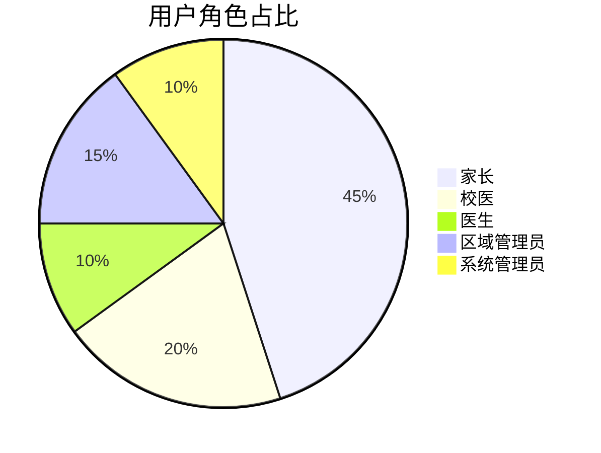
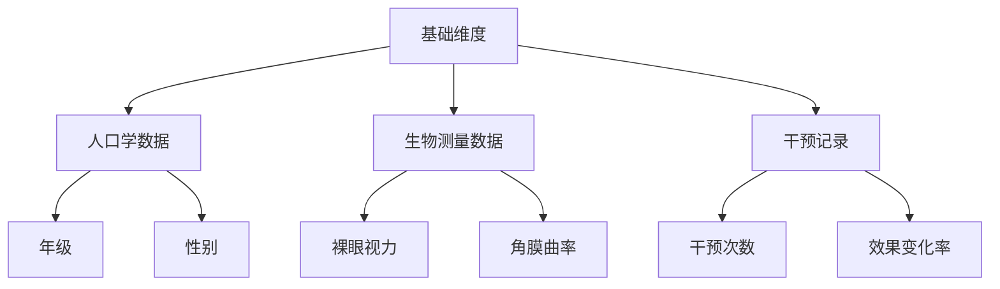

# 近视预防干预系统需求文档_v1.1

下面提供基于原有 v1.1 版本并结合最近讨论情况（包括因意外丢失代码及文档目录结构，需增加自动备份与恢复工具要求等）的新版需求文档和开发文档。

所有修改和新增内容均以【修改】或【新增】标记，原 v1.1 正确的部分全部保留。以下内容均严格遵循原定的文档格式（Markdown 语法）。

------

# 近视预防干预系统需求文档_v1.2

------

## 一、文档管理信息

| 项目     | 内容                                                         |
| -------- | ------------------------------------------------------------ |
| 文档类型 | 需求文档（REQ）                                              |
| 系统名称 | 近视预防干预系统                                             |
| 文档编号 | REQ-20250206-003  【修改：原 REQ-20250206-002 修改为 REQ-20250206-003】 |
| 当前版本 | v1.2         【修改：版本由 v1.1 升级至 v1.2】               |
| 生成日期 | 2025年2月XX日 【修改：更新生成日期】                         |
| 生效日期 | 2025年2月XX日 【修改：更新生效日期】                         |

------

## 二、系统概述

### 2.1 系统目标

建立覆盖学生视力数据录入、近视状况筛查、干预状态跟踪、数据统计分析及图文报表展示输出等全流程的管理系统，实现：

- 多层级（学校/区域）数据聚合
- 动态组合分析（50+维度）
- 智能预警与干预效果评估

【新增】此外，系统必须具备完善的版本管理、备份与恢复机制，确保开发文档、代码及目录结构在意外丢失时能通过一键恢复工具快速恢复。

### 2.2 用户画像



------

## 三、核心功能需求

### 3.1 数据管理模块

#### 3.1.1 数据采集

| 功能点        | 技术实现       | 校验规则                                                     |
| ------------- | -------------- | ------------------------------------------------------------ |
| Excel批量导入 | Pandas数据清洗 | ①文件格式校验（.xlsx）②必填字段校验③视力值范围校验（0.1-5.0）④【新增】针对导入数据： - 对于必填字段数据缺失或校验错误的记录，生成“导入失败记录表”，标记出错误位置及改正要求，以电子表格形式输出。 - 对于非忽略字段数据缺失的记录，可正常导入，但生成“数据不完整记录表”，以电子表格形式输出。 |
| 单条录入      | Bootstrap表单  | 实时AJAX校验                                                 |

> **备注**：
>
> - 导入数据包含“教育ID号”字段，此数据由电子表格导入且非唯一。
> - 系统在导入后自动生成“索引ID”，生成规则为“学校ID+教育ID号”，该“索引ID”字段作为唯一索引保存，同时不覆盖原有的“教育ID号”字段。

#### 3.1.2 数据存储

```python
# 关键字段定义（SQLAlchemy模型节选）
class Student(db.Model):
    __tablename__ = 'students'
    id = db.Column(db.Integer, primary_key=True)
    full_edu_id = db.Column(db.String(20))  # 原始教育ID号，非唯一，由Excel导入
    school_code = db.Column(db.String(6), nullable=False)  # 学校代码
    school_id = db.Column(db.String(20))  # 【新增】字段：学校ID，由系统管理员在基础数据中维护
    index_id = db.Column(db.String(40), unique=True)  # 【新增】字段：索引ID，格式：学校ID+full_edu_id（自动生成）
    vision_left = db.Column(db.Float, nullable=False)
    vision_right = db.Column(db.Float, nullable=False)
    myopia_level = db.Column(db.String(10))  # 自动计算字段：近视等级

class Intervention(db.Model):
    __tablename__ = 'interventions'
    id = db.Column(db.Integer, primary_key=True)
    student_id = db.Column(db.Integer, db.ForeignKey('students.id'))
    phase = db.Column(db.String(10))  # pre/post
    effect_score = db.Column(db.Float)  # 【新增】可由系统管理员后台指定计算规则后保存的新字段（如“右眼-干预-裸眼视力”减“右眼-裸眼视力”）
```

#### 3.1.3 后台数据管理与字段设置

- **字段配置**：系统管理员可以在后台添加新的字段，以适应未来业务扩展的需求。
- **计算字段设置**：系统管理员可以在后台指定某些字段间的计算规则（例如：用“右眼-干预-裸眼视力”减去“右眼-裸眼视力”，计算结果保存到“干预效果”字段中）。
- **数据修改权限及日志**：对于导入的数据，只有系统管理员有权修改，且所有修改过程均需记录日志，日志记录应能随时查询，确保数据修改的可追溯性。

【新增】**代码备份与恢复要求**：系统应支持自动生成和备份完整的项目目录结构及关键初始化文件（如 `__init__.py` 等），并提供一键恢复工具（详见后文开发文档相关描述）。

### 3.2 统计分析模块

#### 3.2.1 分析维度



#### 3.2.2 分析模型

| 分析类型     | 算法实现   | 输出形式                                   |
| ------------ | ---------- | ------------------------------------------ |
| 近视程度分类 | 阈值分段法 | 分级标签（自动计算并保存至“近视等级”字段） |
| 干预效果评估 | 配对T检验  | P值+变化量                                 |
| 趋势预测     | 线性回归   | 预测曲线+置信区间                          |

> **备注**：系统根据以下标准自动对近视程度进行分类，并将结果保存在“近视等级”字段中：
>
> | 分类         | 近视度数范围（等效球镜SE）           |
> | ------------ | ------------------------------------ |
> | 低度近视     | -3.00D < SE ≤ -0.50D（50度至300度）  |
> | 中度近视     | -6.00D < SE ≤ -3.00D（300度至600度） |
> | 高度近视     | SE ≤ -6.00D（超过600度）             |
> | 临床前期近视 | ﹣0.50D < SE ≤ 0.75D                 |
> | 假性近视     | 验光近视散瞳后视力无度数             |

### 3.3 前端功能模块

#### 3.3.1 Web端功能

- 系统数据维护

  ：

  - 支持通过 Web 界面对系统中的数据进行维护，包括数据修改、删除、备份等操作。
  - 所有操作均以交互方式在 Web 页面完成，操作过程中提供必要提示，确保界面简洁、清晰且用户友好。

- 数据导入

  ：

  - 提供批量数据导入功能，支持 Excel 文件上传并自动进行数据校验和预处理。
  - 根据系统管理员设置的必填字段与忽略字段规则，进行数据校验：
    - 必填字段数据缺失或校验错误的记录生成“导入失败记录表”，以电子表格形式输出，并标明错误位置及改正要求。
    - 对于非忽略字段数据缺失的记录，可正常导入，但同时生成“数据不完整记录表”，以电子表格形式输出。
  - 对于正常导入的数据，系统显示导入的学校名称及导入记录条数。

- 交互式数据分析查询

  ：

  - 用户可通过交互界面任意选择数据字段进行多维度组合查询，满足复杂数据分析需求。
  - 查询、统计、分析维度支持依据所有字段以任意方式进行组合，并通过下拉菜单展示给用户选择，支持模糊查询。
  - 查询结果支持以多种图表形式展示（如柱状图、折线图、饼图等），并允许动态切换展示方式。
  - 统计查询结果支持实时刷新，满足交互式分析需求。

- 数据导出

  ：

  - 支持将统计查询结果导出为电子表格（Excel）和 PDF 格式，方便数据分享和离线存档。

- 大屏展示

  ：

  - 系统统计数据可在大屏幕上以可视化图表方式展示，便于实时监控和决策支持。

#### 3.3.2 微信小程序端功能

- 基本信息与统计查询

  ：

  - 用户可在微信小程序端查询自己的基本信息和统计数据。

- 家长角色

  ：

  - 家长只能查询自己账号的信息以及其子女的相关数据。
  - 登录时使用数据导入中记录的家长电话号码，且必须通过实名认证后获得登录权限。

- 其他角色

  ：

  - 其他人员的账号和登录权限由系统管理员在后台统一设置，通过账号及密码登录。

------

## 四、完整数据字段表

### 1. 学生基本信息

| 字段名称 | 类型   | 约束条件                           | 说明                                        |
| -------- | ------ | ---------------------------------- | ------------------------------------------- |
| 教育ID号 | string | 原始导入数据（非唯一）             | 格式：学校代码_原始ID（导入后生成“索引ID”） |
| 学校     | string | 长度2-50字符                       | 学校名称                                    |
| 学校ID   | string | 由系统管理员维护                   | 【新增】用于与“教育ID号”组合生成“索引ID”    |
| 年级     | string | 长度2-10字符                       | 年级名称                                    |
| 班级     | string | 长度2-10字符                       | 班级名称                                    |
| 姓名     | string | 长度2-4汉字                        | 学生姓名                                    |
| 性别     | string | 枚举值（男/女）                    | 学生性别                                    |
| 年龄     | int    | ≥0                                 | 学生年龄                                    |
| 出生日期 | date   | ISO 8601格式（YYYY-MM-DD）         | 学生出生日期                                |
| 联系电话 | string | 正则校验：^1[3-9]\d{9}$            | 学生联系电话                                |
| 身份证   | string | 长度18字符（或符合身份证格式要求） | 学生身份证号码                              |
| 区域     | string | 长度2-50字符                       | 所在区域/行政区划                           |
| 联系地址 | string | 长度5-100字符                      | 学生详细联系地址                            |
| 家长姓名 | string | 长度2-4汉字                        | 法定监护人姓名                              |
| 家长电话 | string | 正则校验：^1[3-9]\d{9}$            | 法定监护人联系电话                          |
| 索引ID   | string | 唯一索引                           | 【新增】生成规则：学校ID + 教育ID号         |

### 2. 健康信息

| 字段名称     | 类型   | 约束条件               | 说明                                       |
| ------------ | ------ | ---------------------- | ------------------------------------------ |
| 身高         | float  | 非负数                 | 学生身高（单位：厘米）                     |
| 体重         | float  | 非负数                 | 学生体重（单位：公斤）                     |
| 饮食偏好     | string | 长度0-50字符           | 学生饮食习惯或偏好                         |
| 运动偏好     | string | 长度0-50字符           | 学生运动喜好                               |
| 健康教育     | string | 长度0-200字符          | 学生健康教育情况或记录                     |
| 既往史       | string | 长度0-200字符          | 既往病史（曾患疾病、病史描述）             |
| 家族史       | string | 长度0-200字符          | 家族遗传史或家族疾病史                     |
| 是否早产     | string | 枚举值（是/否）        | 是否存在早产情况                           |
| 过敏史       | string | 长度0-200字符          | 对药物、食物或其他物质的过敏情况           |
| 矫正方式     | string | 可选（具体定义待确认） | 目前是否有视力矫正措施（如佩戴眼镜等）     |
| 矫正方式类型 | string | 可选（具体定义待确认） | 矫正方式的分类，如“框架眼镜”、“隐形眼镜”等 |

### 3. 视力数据

| 字段名称        | 类型   | 约束条件      | 说明                           |
| --------------- | ------ | ------------- | ------------------------------ |
| 右眼-裸眼视力   | float  | 0.1精度       | 右眼未经矫正的裸眼视力         |
| 左眼-裸眼视力   | float  | 0.1精度       | 左眼未经矫正的裸眼视力         |
| 右眼-矫正视力   | float  | 0.1精度       | 右眼矫正（佩戴眼镜等）后的视力 |
| 左眼-矫正视力   | float  | 0.1精度       | 左眼矫正后的视力               |
| 右眼-角膜曲率K1 | float  | 0.01精度      | 右眼角膜曲率K1值               |
| 左眼-角膜曲率K1 | float  | 0.01精度      | 左眼角膜曲率K1值               |
| 右眼-角膜曲率K2 | float  | 0.01精度      | 右眼角膜曲率K2值               |
| 左眼-角膜曲率K2 | float  | 0.01精度      | 左眼角膜曲率K2值               |
| 右眼-眼轴       | float  | 0.1精度       | 右眼眼轴长度（单位：mm）       |
| 左眼-眼轴       | float  | 0.1精度       | 左眼眼轴长度（单位：mm）       |
| 右眼屈光-球镜   | float  | 0.01精度      | 右眼球镜数据（屈光检查：球镜） |
| 左眼屈光-球镜   | float  | 0.01精度      | 左眼球镜数据                   |
| 右眼屈光-柱镜   | float  | 0.01精度      | 右眼柱镜数据                   |
| 左眼屈光-柱镜   | float  | 0.01精度      | 左眼柱镜数据                   |
| 右眼屈光-轴位   | float  | 1精度         | 右眼屈光轴位（单位：°）        |
| 左眼屈光-轴位   | float  | 1精度         | 左眼屈光轴位（单位：°）        |
| 右眼散瞳-球镜   | float  | 0.01精度      | 右眼散瞳后球镜数据             |
| 左眼散瞳-球镜   | float  | 0.01精度      | 左眼散瞳后球镜数据             |
| 右眼散瞳-柱镜   | float  | 0.01精度      | 右眼散瞳后柱镜数据             |
| 左眼散瞳-柱镜   | float  | 0.01精度      | 左眼散瞳后柱镜数据             |
| 右眼散瞳-轴位   | float  | 1精度         | 右眼散瞳后轴位（单位：°）      |
| 左眼散瞳-轴位   | float  | 1精度         | 左眼散瞳后轴位（单位：°）      |
| 右眼-前房深度   | float  | 非负数        | 右眼前房深度                   |
| 左眼-前房深度   | float  | 非负数        | 左眼前房深度                   |
| 其他情况        | string | 长度0-200字符 | 其他眼部情况说明或备注         |
| 眼疲劳状况      | string | 长度0-100字符 | 学生眼疲劳状况（描述或评分）   |

### 4. 干预记录

#### 4.1 干预后测量数据

| 字段名称           | 类型  | 约束条件 | 说明                                |
| ------------------ | ----- | -------- | ----------------------------------- |
| 右眼-干预-裸眼视力 | float | 0.1精度  | 干预状态下右眼裸眼视力              |
| 左眼-干预-裸眼视力 | float | 0.1精度  | 干预状态下左眼裸眼视力              |
| 右眼屈光-干预-球镜 | float | 0.01精度 | 干预后右眼屈光检查——球镜数据        |
| 右眼屈光-干预-柱镜 | float | 0.01精度 | 干预后右眼屈光检查——柱镜数据        |
| 右眼屈光-干预-轴位 | float | 1精度    | 干预后右眼屈光轴位（单位：°）       |
| 左眼屈光-干预-球镜 | float | 0.01精度 | 干预后左眼屈光检查——球镜数据        |
| 左眼屈光-干预-柱镜 | float | 0.01精度 | 干预后左眼屈光检查——柱镜数据        |
| 左眼屈光-干预-轴位 | float | 1精度    | 干预后左眼屈光轴位（单位：°）       |
| 右眼散瞳-干预-球镜 | float | 0.01精度 | 干预后右眼散瞳检查——球镜数据        |
| 右眼散瞳-干预-柱镜 | float | 0.01精度 | 干预后右眼散瞳检查——柱镜数据        |
| 右眼散瞳-干预-轴位 | float | 1精度    | 干预后右眼散瞳检查——轴位（单位：°） |
| 左眼散瞳-干预-球镜 | float | 0.01精度 | 干预后左眼散瞳检查——球镜数据        |
| 左眼散瞳-干预-柱镜 | float | 0.01精度 | 干预后左眼散瞳检查——柱镜数据        |
| 左眼散瞳-干预-轴位 | float | 1精度    | 干预后左眼散瞳检查——轴位（单位：°） |

#### 4.2 干预时间记录（共16次）

| 字段名称   | 类型     | 约束条件     | 说明                     |
| ---------- | -------- | ------------ | ------------------------ |
| 第1次干预  | datetime | ISO 8601格式 | 第1次干预记录日期及时间  |
| 第2次干预  | datetime | ISO 8601格式 | 第2次干预记录日期及时间  |
| 第3次干预  | datetime | ISO 8601格式 | 第3次干预记录日期及时间  |
| 第4次干预  | datetime | ISO 8601格式 | 第4次干预记录日期及时间  |
| 第5次干预  | datetime | ISO 8601格式 | 第5次干预记录日期及时间  |
| 第6次干预  | datetime | ISO 8601格式 | 第6次干预记录日期及时间  |
| 第7次干预  | datetime | ISO 8601格式 | 第7次干预记录日期及时间  |
| 第8次干预  | datetime | ISO 8601格式 | 第8次干预记录日期及时间  |
| 第9次干预  | datetime | ISO 8601格式 | 第9次干预记录日期及时间  |
| 第10次干预 | datetime | ISO 8601格式 | 第10次干预记录日期及时间 |
| 第11次干预 | datetime | ISO 8601格式 | 第11次干预记录日期及时间 |
| 第12次干预 | datetime | ISO 8601格式 | 第12次干预记录日期及时间 |
| 第13次干预 | datetime | ISO 8601格式 | 第13次干预记录日期及时间 |
| 第14次干预 | datetime | ISO 8601格式 | 第14次干预记录日期及时间 |
| 第15次干预 | datetime | ISO 8601格式 | 第15次干预记录日期及时间 |
| 第16次干预 | datetime | ISO 8601格式 | 第16次干预记录日期及时间 |

------

## 五、权限管理体系

### 5.1 权限矩阵

| 角色       | 查看范围 | 数据修改权限 | 报告生成权限 | 系统设置权限 |
| ---------- | -------- | ------------ | ------------ | ------------ |
| 家长       | 本人子女 | ×            | ×            | ×            |
| 校医       | 本校范围 | √            | √            | ×            |
| 医生       | 全系统   | √            | √            | ×            |
| 区域管理员 | 辖区范围 | ×            | √            | ×            |
| 系统管理员 | 全系统   | √            | √            | √            |

### 5.2 权限验证逻辑

```python
# Flask权限装饰器示例【新增】增加日志记录功能
def role_required(role):
    def decorator(f):
        @wraps(f)
        def decorated_function(*args, **kwargs):
            if current_user.role != role:
                # 【修改】记录未授权访问日志
                log_unauthorized_access(current_user, f.__name__)
                abort(403)
            return f(*args, **kwargs)
        return decorated_function
    return decorator
```

------

## 六、非功能性需求

### 6.1 性能指标

| 场景     | 基准要求           | 测试方法        |
| -------- | ------------------ | --------------- |
| 数据导入 | ≥1000条/分钟       | JMeter压力测试  |
| 组合查询 | ≤3秒（百万级数据） | EXPLAIN ANALYZE |
| 并发访问 | 支持200+并发       | LoadRunner模拟  |

### 6.2 安全要求

| 安全层级         | 实施措施                                                     |
| ---------------- | ------------------------------------------------------------ |
| 数据安全         | AES-256加密存储敏感字段                                      |
| 访问安全         | JWT令牌验证+IP白名单                                         |
| 审计安全         | 全操作日志（保留180天）                                      |
| 【新增】备份安全 | 定期自动备份项目代码、配置文件及目录结构，并提供一键恢复工具 |

------

## 七、文档变更历史

| 版本 | 修订日期   | 修订内容                                                     | 审核人   |
| ---- | ---------- | ------------------------------------------------------------ | -------- |
| v1.0 | 2025-02-03 | 初始版本：整合全部已确认需求                                 | [待签核] |
| v1.1 | 2025-02-06 | 增加和细化需求调整：1. 增加“学校ID”字段；2. “教育ID号”导入后自动生成“索引ID”字段；3. 系统管理员可在后台添加字段；4. 系统管理员可指定字段间计算规则（例如“右眼-干预-裸眼视力”减“右眼-裸眼视力”，结果保存至“干预效果”字段）；5. 导入数据仅允许系统管理员修改，且修改过程记录日志；6. 数据导入时分别生成“导入失败记录表”与“数据不完整记录表”；7. Web页面支持交互式操作及多种导出格式；8. 自动计算近视分类保存至“近视等级”字段。 | [待签核] |
| v1.2 | 2025-XX-XX | 【新增】1. 增加系统自动备份与目录结构恢复要求及一键恢复工具；【修改】权限验证中增加未授权访问日志记录；【修改】部分文字描述补充和优化；【修改】文档编号、生成日期更新。 | [待签核] |

------

【说明】
 本版本 v1.2 在 v1.1 基础上主要做出以下修改和新增：

- 【新增】系统要求中增加自动备份与目录结构恢复机制，以应对因意外丢失代码和文档目录结构的情况；
- 【修改】在权限验证逻辑中增加日志记录功能；
- 【修改】对部分文字描述做了补充和优化，文档编号及生成日期均已更新。

------

