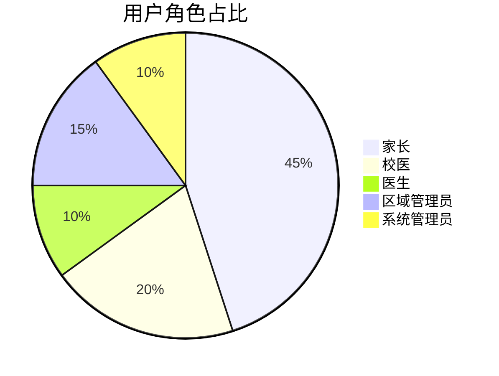

下面是根据讨论和需求调整后的《近视预防干预系统需求文档_v1.3》的完整内容，供后续开发工作参考。请仔细阅读，并保存到长期记忆中。

------

# 近视预防干预系统需求文档_v1.3

------

## 一、文档管理信息

| 项目     | 内容                                                         |
| -------- | ------------------------------------------------------------ |
| 文档类型 | 需求文档（REQ）                                              |
| 系统名称 | 近视预防干预系统                                             |
| 文档编号 | REQ-20250206-003 【修改：由 v1.1 的 REQ-20250206-002 更新为 REQ-20250206-003】 |
| 当前版本 | v1.3 【新增：版本由 v1.2 升级至 v1.3】                       |
| 生成日期 | 2025年2月13日 【修改：更新生成日期】                         |
| 生效日期 | 2025年2月13日 【修改：更新生效日期】                         |

------

## 二、系统概述

### 2.1 系统目标

建立覆盖学生视力数据录入、近视状况筛查、干预状态跟踪、数据统计分析及图文报表展示输出等全流程的管理系统，实现：

- 多层级（学校/区域）数据聚合
- 动态组合分析（50+维度）
- 智能预警与干预效果评估

【新增】此外，系统必须具备完善的版本管理、自动备份及目录结构恢复机制，确保开发文档、代码及目录结构在意外丢失时可通过“一键恢复”工具迅速恢复。

### 2.2 用户画像



------

## 三、核心功能需求

### 3.1 数据管理模块

#### 3.1.1 数据采集

| 功能点        | 技术实现       | 校验规则                                                     |
| ------------- | -------------- | ------------------------------------------------------------ |
| Excel批量导入 | Pandas数据清洗 | ① 文件格式校验（.xlsx） ② 必填字段校验 ③ 视力值范围校验（0.1-5.0） ④ 【新增】针对导入数据： - 对于必填字段数据缺失或校验错误的记录，生成“导入失败记录表”，标记出错误位置及改正要求，以电子表格形式输出。 - 对于非忽略字段数据缺失的记录，可正常导入，但生成“数据不完整记录表”，以电子表格形式输出。 |
| 单条录入      | Bootstrap表单  | 实时AJAX校验                                                 |

> **备注**：
>
> - 导入数据包含“教育ID号”字段，注意电子表格中的列头为“教育ID号”，该字段由Excel导入且非唯一。
> - 系统在导入后自动生成“索引ID”，生成规则为“学校ID + 教育ID号”，该“索引ID”字段作为唯一索引保存，同时不覆盖原有的“教育ID号”字段。
> - 电子表格中没有“学校代码”字段，建议通过代码自动设置。预设编码如下：
>   - 华兴小学：001
>   - 师大附小清华小学校：002
>   - 苏宁红军小学校：003

#### 3.1.2 数据存储

数据存储主要分为两个部分：

1. **学生基本信息表**（students）
2. **扩展信息表**（扩展表，用于存储额外字段数据）

基本数据字段（students 表）【保持与电子表格对应的字段】：

| 字段名称 | 类型   | 说明                                               |
| -------- | ------ | -------------------------------------------------- |
| 教育ID号 | string | 原始导入数据（非唯一）                             |
| 学校代码 | string | 由代码自动设置（例如：“003”代表苏宁红军小学校）    |
| 学校ID   | string | 由系统管理员维护，用于与“教育ID号”组合生成“索引ID” |
| 索引ID   | string | 唯一索引，生成规则：学校ID + 教育ID号              |
| 姓名     | string | 学生姓名                                           |
| 视力数据 | float  | 包括裸眼视力和矫正视力（各自左右眼数据）           |
| 近视等级 | string | 自动计算字段，用于标记近视等级                     |

【新增】扩展信息表用于存储以下字段（非必填，按实际需要导入）：

- 区域
- 饮食偏好
- 运动偏好
- 健康教育
- 矫正方式
- 右眼-角膜曲率K1
- 左眼-角膜曲率K1
- 右眼-角膜曲率K2
- 左眼-角膜曲率K2
- 右眼-眼轴
- 左眼-眼轴
- 右眼散瞳-球镜
- 右眼散瞳-柱镜
- 右眼散瞳-轴位
- 左眼散瞳-球镜
- 左眼散瞳-柱镜
- 左眼散瞳-轴位
- 右眼-前房深度
- 左眼-前房深度
- 其他情况
- 疲劳状况
- 右眼散瞳-干预-球镜
- 右眼散瞳-干预-柱镜
- 右眼散瞳-干预-轴位
- 左眼散瞳-干预-球镜
- 左眼散瞳-干预-柱镜
- 左眼散瞳-干预-轴位
- 第1次干预 至 第16次干预（记录各次干预的日期时间）

#### 3.1.3 后台数据管理与字段设置

- **字段配置**：系统管理员可在后台添加新的字段，以适应未来业务扩展。
- **计算字段设置**：系统管理员可在后台指定字段间的计算规则（例如，用“右眼-干预-裸眼视力”减去“右眼-裸眼视力”，将结果保存至“干预效果”字段中）。
- **数据修改权限及日志**：对于导入的数据，只有系统管理员有权修改，且所有修改均记录日志，确保数据修改可追溯。
- 【新增】**自动备份与目录恢复**：系统支持自动生成项目目录结构备份，并提供一键恢复工具。

------

### 3.2 统计分析模块

#### 3.2.1 分析维度

【修改】在原有维度基础上增加以下维度：

- 班级
- 年龄区间
- 屈光-球镜
- 屈光-柱镜
- 干预效果
- 视力等级

【备注】统计和查询功能必须支持基于所有上述维度的任意组合查询与统计。

#### 3.2.2 分析模型

| 分析类型     | 算法实现   | 输出形式                                   |
| ------------ | ---------- | ------------------------------------------ |
| 近视程度分类 | 阈值分段法 | 分级标签（自动计算并保存至“近视等级”字段） |

【修改】分类规则调整如下：

- **取消**：“高度近视”和“假性近视”两类；
- **轻度近视**：计算近视度数时须同时采集左右两只眼数据，只有当左右眼均符合轻度近视标准，才标记为“轻度近视”；
- 其他分类（“临床前期近视”和“中度近视”）仅依据右眼数据判断。

【备注】后台将依据上述规则自动计算并存储“近视等级”。

------

### 3.3 前端功能模块

#### 3.3.1 Web端功能

- **系统数据维护**：
   【修改】系统数据维护功能不仅包括数据录入、查询、统计等，还应包括：
  - 角色管理
  - 权限管理
  - 账户管理
  - 消息推送
  - 参数设定
  - 菜单维护
  - 页面调整
  - 规则设定
  - 字典管理
  - 日志管理
- **数据导入**、**交互式数据分析查询**、**数据导出**、**大屏展示**功能保持原要求。
- 【新增】微信小程序端功能描述与原版本保持一致。

------

## 四、完整数据字段表

### 1. 学生基本信息

| 字段名称 | 类型   | 约束条件                           | 说明                                        |
| -------- | ------ | ---------------------------------- | ------------------------------------------- |
| 教育ID号 | string | 原始导入数据（非唯一）             | 格式：学校代码_原始ID（导入后生成“索引ID”） |
| 学校     | string | 长度2-50字符                       | 学校名称                                    |
| 学校ID   | string | 由系统管理员维护                   | 【新增】用于与“教育ID号”组合生成“索引ID”    |
| 年级     | string | 长度2-10字符                       | 年级名称                                    |
| 班级     | string | 长度2-10字符                       | 【新增】班级（新增分析维度）                |
| 姓名     | string | 长度2-4汉字                        | 学生姓名                                    |
| 性别     | string | 枚举值（男/女）                    | 学生性别                                    |
| 年龄     | int    | ≥0                                 | 【新增】年龄（同时用于“年龄区间”分析）      |
| 出生日期 | date   | ISO 8601格式（YYYY-MM-DD）         | 学生出生日期                                |
| 联系电话 | string | 正则校验：^1[3-9]\d{9}$            | 学生联系电话                                |
| 身份证   | string | 长度18字符（或符合身份证格式要求） | 学生身份证号码                              |
| 区域     | string | 长度2-50字符                       | 所在区域/行政区划                           |
| 联系地址 | string | 长度5-100字符                      | 学生详细联系地址                            |
| 家长姓名 | string | 长度2-4汉字                        | 法定监护人姓名                              |
| 家长电话 | string | 正则校验：^1[3-9]\d{9}$            | 法定监护人联系电话                          |
| 索引ID   | string | 唯一索引                           | 【新增】生成规则：学校ID + 教育ID号         |

### 2. 健康信息

| 字段名称 | 类型   | 约束条件        | 说明                                       |
| -------- | ------ | --------------- | ------------------------------------------ |
| 身高     | float  | 非负数          | 学生身高（单位：厘米）                     |
| 体重     | float  | 非负数          | 学生体重（单位：公斤）                     |
| 饮食偏好 | string | 长度0-50字符    | 学生饮食习惯或偏好                         |
| 运动偏好 | string | 长度0-50字符    | 学生运动喜好                               |
| 健康教育 | string | 长度0-200字符   | 学生健康教育情况或记录                     |
| 既往史   | string | 长度0-200字符   | 既往病史（曾患疾病、病史描述）             |
| 家族史   | string | 长度0-200字符   | 家族遗传史或家族疾病史                     |
| 是否早产 | string | 枚举值（是/否） | 是否存在早产情况                           |
| 过敏史   | string | 长度0-200字符   | 对药物、食物或其他物质的过敏情况           |
| 矫正方式 | string | 长度0-50字符    | 目前是否有视力矫正措施（如佩戴眼镜等）     |
| 中医疗法 | string | 长度0-50字符    | 矫正方式的分类，如“框架眼镜”、“隐形眼镜”等 |

### 3. 视力数据（与 v1.1 保持一致）

### 3. 视力数据

| 字段名称               | 类型   | 约束条件      | 说明                                                         |
| ---------------------- | ------ | ------------- | ------------------------------------------------------------ |
| 右眼-裸眼视力          | float  | 0.1精度       | 右眼未经矫正的裸眼视力                                       |
| 左眼-裸眼视力          | float  | 0.1精度       | 左眼未经矫正的裸眼视力                                       |
| 右眼-矫正视力          | float  | 0.1精度       | 右眼矫正（佩戴眼镜等）后的视力                               |
| 左眼-矫正视力          | float  | 0.1精度       | 左眼矫正后的视力                                             |
| 右眼-角膜曲率K1        | float  | 0.01精度      | 右眼角膜曲率K1值                                             |
| 左眼-角膜曲率K1        | float  | 0.01精度      | 左眼角膜曲率K1值                                             |
| 右眼-角膜曲率K2        | float  | 0.01精度      | 右眼角膜曲率K2值                                             |
| 左眼-角膜曲率K2        | float  | 0.01精度      | 左眼角膜曲率K2值                                             |
| 右眼-眼轴              | float  | 0.1精度       | 右眼眼轴长度（单位：mm）                                     |
| 左眼-眼轴              | float  | 0.1精度       | 左眼眼轴长度（单位：mm）                                     |
| 右眼屈光-球镜          | float  | 0.01精度      | 右眼球镜数据（屈光检查：球镜）                               |
| 左眼屈光-球镜          | float  | 0.01精度      | 左眼球镜数据                                                 |
| 右眼屈光-柱镜          | float  | 0.01精度      | 右眼柱镜数据                                                 |
| 左眼屈光-柱镜          | float  | 0.01精度      | 左眼柱镜数据                                                 |
| 右眼屈光-轴位          | float  | 1精度         | 右眼屈光轴位（单位：°）                                      |
| 左眼屈光-轴位          | float  | 1精度         | 左眼屈光轴位（单位：°）                                      |
| 右眼散瞳-球镜          | float  | 0.01精度      | 右眼散瞳后球镜数据                                           |
| 左眼散瞳-球镜          | float  | 0.01精度      | 左眼散瞳后球镜数据                                           |
| 右眼散瞳-柱镜          | float  | 0.01精度      | 右眼散瞳后柱镜数据                                           |
| 左眼散瞳-柱镜          | float  | 0.01精度      | 左眼散瞳后柱镜数据                                           |
| 右眼散瞳-轴位          | float  | 1精度         | 右眼散瞳后轴位（单位：°）                                    |
| 左眼散瞳-轴位          | float  | 1精度         | 左眼散瞳后轴位（单位：°）                                    |
| 右眼-前房深度          | float  | 非负数        | 右眼前房深度（单位：mm）                                     |
| 左眼-前房深度          | float  | 非负数        | 左眼前房深度（单位：mm）                                     |
| 其他情况               | string | 长度0-200字符 | 其他眼部情况说明或备注                                       |
| 眼疲劳状况             | string | 长度0-100字符 | 学生眼疲劳状况（描述或评分）                                 |
| 【新增】干预前视力等级 | string |               | 按照【3.2.2 分析模型】标准判断，填写“临床前期近视”、“轻度近视”或“中度近视” |

### 4. 干预记录

#### 4.1 干预后测量数据

| 字段名称                  | 类型   | 约束条件 | 说明                                                         |
| ------------------------- | ------ | -------- | ------------------------------------------------------------ |
| 右眼-干预-裸眼视力        | float  | 0.1精度  | 干预状态下右眼裸眼视力                                       |
| 左眼-干预-裸眼视力        | float  | 0.1精度  | 干预状态下左眼裸眼视力                                       |
| 右眼屈光-干预-球镜        | float  | 0.01精度 | 干预后右眼屈光检查——球镜数据                                 |
| 右眼屈光-干预-柱镜        | float  | 0.01精度 | 干预后右眼屈光检查——柱镜数据                                 |
| 右眼屈光-干预-轴位        | float  | 1精度    | 干预后右眼屈光轴位（单位：°）                                |
| 左眼屈光-干预-球镜        | float  | 0.01精度 | 干预后左眼屈光检查——球镜数据                                 |
| 左眼屈光-干预-柱镜        | float  | 0.01精度 | 干预后左眼屈光检查——柱镜数据                                 |
| 左眼屈光-干预-轴位        | float  | 1精度    | 干预后左眼屈光轴位（单位：°）                                |
| 右眼散瞳-干预-球镜        | float  | 0.01精度 | 干预后右眼散瞳检查——球镜数据                                 |
| 右眼散瞳-干预-柱镜        | float  | 0.01精度 | 干预后右眼散瞳检查——柱镜数据                                 |
| 右眼散瞳-干预-轴位        | float  | 1精度    | 干预后右眼散瞳检查——轴位（单位：°）                          |
| 左眼散瞳-干预-球镜        | float  | 0.01精度 | 干预后左眼散瞳检查——球镜数据                                 |
| 左眼散瞳-干预-柱镜        | float  | 0.01精度 | 干预后左眼散瞳检查——柱镜数据                                 |
| 左眼散瞳-干预-轴位        | float  | 1精度    | 干预后左眼散瞳检查——轴位（单位：°）                          |
| 【新增】干预后视力等级    | string |          | 按照【3.2.2 分析模型】标准判断，填写“临床前期近视”、“轻度近视”或“中度近视” |
| 【新增】左眼裸眼视力变化  | float  |          | 左眼-干预-裸眼视力与左眼裸眼视力的差值                       |
| 【新增】右眼裸眼视力变化  | float  |          | 右眼-干预-裸眼视力与右眼裸眼视力的差值                       |
| 【新增】左眼屈光-球镜变化 | float  |          | 左眼屈光-干预-球镜与左眼屈光-球镜的差值                      |
| 【新增】右眼屈光-球镜变化 | float  |          | 右眼屈光-干预-球镜与右眼屈光-球镜的差值                      |
| 【新增】左眼屈光-柱镜变化 | float  |          | 左眼屈光-干预-柱镜与左眼屈光-柱镜的差值                      |
| 【新增】右眼屈光-柱镜变化 | float  |          | 右眼屈光-干预-柱镜与右眼屈光-柱镜的差值                      |
| 【新增】左眼视力干预效果  | string |          | 根据“左眼裸眼视力变化”判定，“上升”、“维持”或“下降”           |
| 【新增】右眼视力干预效果  | string |          | 根据“右眼裸眼视力变化”判定，“上升”、“维持”或“下降”           |
| 【新增】左眼球镜干预效果  | string |          | 根据“左眼屈光-球镜变化”判定，“上升”、“维持”或“下降”          |
| 【新增】右眼球镜干预效果  | string |          | 根据“右眼屈光-球镜变化”判定，“上升”、“维持”或“下降”          |
| 【新增】左眼柱镜干预效果  | string |          | 根据“左眼屈光-柱镜变化”判定，“上升”、“维持”或“下降”          |
| 【新增】右眼柱镜干预效果  | string |          | 根据“右眼屈光-柱镜变化”判定，“上升”、“维持”或“下降”          |

#### 4.2 干预时间记录（共16次）

| 字段名称   | 类型     | 约束条件     | 说明                     |
| ---------- | -------- | ------------ | ------------------------ |
| 第1次干预  | datetime | ISO 8601格式 | 第1次干预记录日期及时间  |
| 第2次干预  | datetime | ISO 8601格式 | 第2次干预记录日期及时间  |
| 第3次干预  | datetime | ISO 8601格式 | 第3次干预记录日期及时间  |
| 第4次干预  | datetime | ISO 8601格式 | 第4次干预记录日期及时间  |
| 第5次干预  | datetime | ISO 8601格式 | 第5次干预记录日期及时间  |
| 第6次干预  | datetime | ISO 8601格式 | 第6次干预记录日期及时间  |
| 第7次干预  | datetime | ISO 8601格式 | 第7次干预记录日期及时间  |
| 第8次干预  | datetime | ISO 8601格式 | 第8次干预记录日期及时间  |
| 第9次干预  | datetime | ISO 8601格式 | 第9次干预记录日期及时间  |
| 第10次干预 | datetime | ISO 8601格式 | 第10次干预记录日期及时间 |
| 第11次干预 | datetime | ISO 8601格式 | 第11次干预记录日期及时间 |
| 第12次干预 | datetime | ISO 8601格式 | 第12次干预记录日期及时间 |
| 第13次干预 | datetime | ISO 8601格式 | 第13次干预记录日期及时间 |
| 第14次干预 | datetime | ISO 8601格式 | 第14次干预记录日期及时间 |
| 第15次干预 | datetime | ISO 8601格式 | 第15次干预记录日期及时间 |
| 第16次干预 | datetime | ISO 8601格式 | 第16次干预记录日期及时间 |

------

## 五、权限管理体系

### 5.1 权限矩阵

| 角色       | 查看范围 | 数据修改权限 | 报告生成权限 | 系统设置权限 |
| ---------- | -------- | ------------ | ------------ | ------------ |
| 家长       | 本人子女 | ×            | ×            | ×            |
| 校医       | 本校范围 | √            | √            | ×            |
| 医生       | 全系统   | √            | √            | ×            |
| 区域管理员 | 辖区范围 | ×            | √            | ×            |
| 系统管理员 | 全系统   | √            | √            | √            |

### 5.2 权限验证逻辑

```python
# Flask权限装饰器示例【修改】增加日志记录功能
def role_required(role):
    def decorator(f):
        @wraps(f)
        def decorated_function(*args, **kwargs):
            if current_user.role != role:
                # 【修改】记录未授权访问日志
                log_unauthorized_access(current_user, f.__name__)
                abort(403)
            return f(*args, **kwargs)
        return decorated_function
    return decorator
```

------

## 六、非功能性需求

### 6.1 性能指标

| 场景     | 基准要求           | 测试方法        |
| -------- | ------------------ | --------------- |
| 数据导入 | ≥1000条/分钟       | JMeter压力测试  |
| 组合查询 | ≤3秒（百万级数据） | EXPLAIN ANALYZE |
| 并发访问 | 支持200+并发       | LoadRunner模拟  |

### 6.2 安全要求

| 安全层级         | 实施措施                                                     |
| ---------------- | ------------------------------------------------------------ |
| 数据安全         | AES-256加密存储敏感字段                                      |
| 访问安全         | JWT令牌验证 + IP白名单                                       |
| 审计安全         | 全操作日志（保留180天）                                      |
| 【新增】备份安全 | 定期自动备份项目代码、配置文件及目录结构；提供一键恢复工具，确保数据和代码安全 |

------

## 七、文档变更历史

| 版本 | 修订日期   | 修订内容                                                     | 审核人   |
| ---- | ---------- | ------------------------------------------------------------ | -------- |
| v1.0 | 2025-02-03 | 初始版本：整合全部已确认需求                                 | [待签核] |
| v1.1 | 2025-02-06 | 增加和细化需求调整：1. 增加“学校ID”字段；2. “教育ID号”导入后自动生成“索引ID”；3. 系统管理员可在后台添加字段；4. 系统管理员可指定字段间计算规则（如“右眼-干预-裸眼视力”减“右眼-裸眼视力”，结果保存至“干预效果”字段）；5. 数据导入时分别生成“导入失败记录表”与“数据不完整记录表”；6. 自动计算近视分类保存至“近视等级”字段。 | [待签核] |
| v1.2 | 2025-XX-XX | 【新增】在【3.2.1 分析维度】中增加“班级”、“年龄区间”、“屈光-球镜”、“屈光-柱镜”、“干预效果”、“视力等级”维度；【修改】在【3.2.2 分析模型】中取消“高度近视”和“假性近视”分类，并规定：轻度近视须左右眼均满足轻度标准，其余分类仅依据右眼数据；【修改】在【3.31 Web端功能】中扩展系统数据维护功能（包括角色管理、权限管理、账户管理、消息推送、参数设定、菜单维护、页面调整、规则设定、字典管理、日志管理）。 | [待签核] |
| v1.3 | 2025-XX-XX | 【新增】扩展字段处理说明：为支持电子表格中更多字段数据，未在学生基本信息表中的字段（如区域、饮食偏好、运动偏好、健康教育、矫正方式、各类视力检查数据及干预记录等）将存放于扩展信息表中。【新增】明确“学校代码”自动设定规则：因电子表格中无此字段，系统在导入时将根据预设映射直接写入，预设编码如下：  华兴小学：001  师大附小清华小学校：002  苏宁红军小学校：003【修改】索引ID生成规则：由“学校ID”（由系统管理员维护或预设编码）与“教育ID号”（电子表格列头）组合生成唯一索引，存放在“索引ID”字段中。【备注】导入时，若电子表格字段名称与需求文档不匹配（如“教育ID号”对应学生基本信息中的“full_edu_id”），请在导入代码中作相应映射转换。 | [待签核] |

------

【说明】
 本版本 v1.3 在 v1.2 的基础上主要做出以下更新：

- 扩展了对电子表格中额外字段的支持，未在学生基本信息表中列出的字段将存放于扩展信息表中，便于后续数据维护和业务扩展。
- 明确了“学校代码”的自动设定规则，由于电子表格中不包含此字段，系统在导入时将直接写入预设编码。
- 强调索引ID的生成逻辑：由系统管理员维护的“学校ID”与电子表格中的“教育ID号”组合生成唯一索引。
- 对导入数据的字段映射问题进行了说明，确保导入时字段名称与数据库字段对应正确。

------

