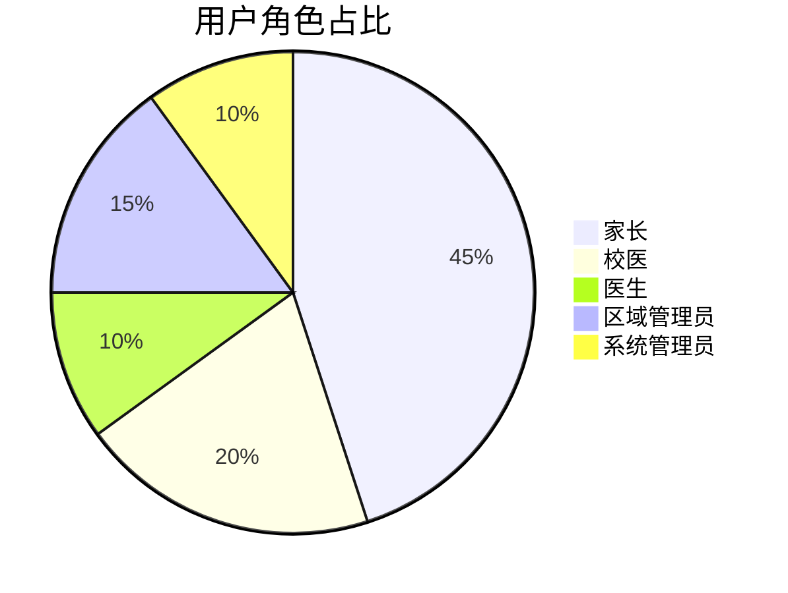

下面是根据讨论和需求调整后的《近视预防干预系统需求文档_v1.4》的完整内容，供后续开发工作参考。请仔细阅读，并保存到长期记忆中。

------

# 近视预防干预系统需求文档_v1.3

------

## 一、文档管理信息

| 项目     | 内容                                                         |
| -------- | ------------------------------------------------------------ |
| 文档类型 | 需求文档（REQ）                                              |
| 系统名称 | 近视预防干预系统                                             |
| 文档编号 | REQ-20250206-003 【修改：由 v1.1 的 REQ-20250206-002 更新为 REQ-20250206-003】 |
| 当前版本 | v1.3 【新增：版本由 v1.2 升级至 v1.3】                       |
| 生成日期 | 2025年2月13日 【修改：更新生成日期】                         |
| 生效日期 | 2025年2月13日 【修改：更新生效日期】                         |

------

## 二、系统概述

### 2.1 系统目标

建立覆盖学生视力数据录入、近视状况筛查、干预状态跟踪、数据统计分析及图文报表展示输出等全流程的管理系统，实现：

- 多层级（学校/区域）数据聚合
- 动态组合分析（50+维度）
- 智能预警与干预效果评估

【新增】此外，系统必须具备完善的版本管理、自动备份及目录结构恢复机制，确保开发文档、代码及目录结构在意外丢失时可通过“一键恢复”工具迅速恢复。

### 2.2 用户画像



------

## 三、核心功能需求

### 3.1 数据管理模块

#### 3.1.1 数据采集

| 功能点        | 技术实现       | 校验规则                                                     |
| ------------- | -------------- | ------------------------------------------------------------ |
| Excel批量导入 | Pandas数据清洗 | ① 文件格式校验（.xlsx） ② 必填字段校验 ③ 视力值范围校验（0.1-5.0） ④ 【新增】针对导入数据： - 对于必填字段数据缺失或校验错误的记录，生成“导入失败记录表”，标记出错误位置及改正要求，以电子表格形式输出。 - 对于非忽略字段数据缺失的记录，可正常导入，但生成“数据不完整记录表”，以电子表格形式输出。 |
| 单条录入      | Bootstrap表单  | 实时AJAX校验                                                 |

#### 3.1.2 数据存储

数据存储主要分为两个部分：

1. **学生基本信息表**（students）
2. **扩展信息表**（扩展表，用于存储额外字段数据）

- 具体数据字段见后本文档后面的**“四、完整数据字段表”**

#### 3.1.3 后台数据管理与字段设置

- **字段配置**：系统管理员可在后台添加新的字段，以适应未来业务扩展。
- **计算字段设置**：系统管理员可在后台指定字段间的计算规则（例如，用“右眼-干预-裸眼视力”减去“右眼-裸眼视力”，将结果保存至“干预效果”字段中）。
- **数据修改权限及日志**：对于导入的数据，只有系统管理员有权修改，且所有修改均记录日志，确保数据修改可追溯。
- 【新增】**自动备份与目录恢复**：系统支持自动生成项目目录结构备份，并提供一键恢复工具。

------

### 3.2 数据查询统计分析模块

#### 3.2.1 数据查询模块

* 根据多种维度进行数查询，详细功能见《数据查询模块详细设计方案》

#### 3.2.2 数据统计分析模块

- 支持根据导入的数据做各种维度的统计分析
- 一部分统计计算的结果，要保存到数据库相应的字段中，并支持查询模块进行组合查询
- 统计分析的结果，要能够以各种统计图表的形式进行静态或动态展示

------

### 3.3 前端功能模块

#### 3.3.1 Web端功能

- **顶部导航栏**

  * 独立封装成组件，供各个页面调用
  * 提供用户等和个人中心下拉菜单
  * 提供全屏按钮
  * 提供侧边栏折叠按钮

  **注：具体见《顶部导航栏组件开发及使用技术文档》**

- **侧边栏导航组件**

  * 独立封装成组件，供各个页面调用
  * 提供功能导航菜单
  * 菜单内容动态加载

  **注：具体详见《侧边栏导航组件开发及使用技术文档》**

- - 
- **数据导入**、**交互式数据分析查询**、**数据导出**、**大屏展示**等功能，详见各自的技术开发文档。
- 【新增】微信小程序端功能描述与原版本保持一致。

------

## 四、完整数据字段表


------

## 1. 学生基本信息表（students）

| 电子表格列名称 | 数据库字段      | 数据类型 | 约束条件说明                    | 用途说明                                     |
| -------------- | --------------- | -------- | ------------------------------- | -------------------------------------------- |
| 教育ID号       | education_id    | string   | 必填；唯一，不可重复            | 学生的唯一教育标识，原始导入数据，不允许重复 |
| 学校           | school          | string   | 必填；长度2-50                  | 学校名称                                     |
| 班级           | class_name      | string   | 必填；长度2-10                  | 学生所在班级                                 |
| 姓名           | name            | string   | 必填；长度2-4汉字               | 学生姓名                                     |
| 性别           | gender          | string   | 必填；枚举值：男/女             | 学生性别                                     |
| 身份证号码     | id_card         | string   | 可选；建议长度18                | 学生身份证号码（有可能部分学生无身份证）     |
| 出生日期       | birthday        | date     | 可选；格式：YYYY-MM-DD          | 学生出生日期                                 |
| 联系电话       | phone           | string   | 可选；正则校验（^1[3-9]\d{9}$） | 学生联系电话                                 |
| 区域           | region          | string   | 可选；长度2-50                  | 学生所在区域/行政区划                        |
| 联系地址       | contact_address | string   | 可选；长度5-100                 | 学生详细联系地址                             |
| 家长姓名       | parent_name     | string   | 可选；长度2-4汉字               | 法定监护人姓名                               |
| 家长电话       | parent_phone    | string   | 可选；正则校验（^1[3-9]\d{9}$） | 法定监护人联系电话                           |

**备注：**
 基本信息表中的数据为不随时间变化的字段。必填字段仅包括：education_id、school、class_name、name、gender、。

------

## 2. 学生扩展信息表（student_extensions）

| 电子表格列名称     | 数据库字段                    | 数据类型 | 约束条件说明                            | 用途说明                                                     |
| ------------------ | ----------------------------- | -------- | --------------------------------------- | ------------------------------------------------------------ |
| 年级               | grade                         | string   | 可选；长度2-10                          | 学生年级（随数据年份变化，每个数据年份记录一次）             |
| 数据年份           | data_year                     | string   | 必填；格式为4位年份（如 "2024"）        | 导入数据所属的年份，用于区分同一学生不同年份的记录           |
| 年龄               | age                           | int      | 可选：非负数                            | 年龄数字                                                     |
| 身高               | height                        | float    | 可选；非负数                            | 学生身高（单位：厘米）                                       |
| 体重               | weight                        | float    | 可选；非负数                            | 学生体重（单位：公斤）                                       |
| 饮食偏好           | diet_preference               | string   | 可选；长度0-50                          | 学生饮食习惯或偏好                                           |
| 运动偏好           | exercise_preference           | string   | 可选；长度0-50                          | 学生运动喜好                                                 |
| 健康教育           | health_education              | string   | 可选；长度0-200                         | 学生健康教育情况或记录                                       |
| 既往史             | past_history                  | string   | 可选；长度0-200                         | 既往病史描述                                                 |
| 家族史             | family_history                | string   | 可选；长度0-200                         | 家族遗传史或家族疾病史                                       |
| 是否早产           | premature                     | string   | 可选；枚举值：是/否                     | 是否存在早产情况                                             |
| 过敏史             | allergy                       | string   | 可选；长度0-200                         | 对药物、食物或其他物质的过敏情况                             |
| 右眼-裸眼视力      | right_eye_naked               | float    | 可选；0.1精度                           | 右眼未经矫正的裸眼视力（非干预数据）                         |
| 左眼-裸眼视力      | left_eye_naked                | float    | 可选；0.1精度                           | 左眼未经矫正的裸眼视力（非干预数据）                         |
| 右眼-矫正视力      | right_eye_corrected           | float    | 可选；0.1精度                           | 右眼矫正视力                                                 |
| 左眼-矫正视力      | left_eye_corrected            | float    | 可选；0.1精度                           | 左眼矫正视力                                                 |
| 右眼-角膜曲率K1    | right_keratometry_K1          | float    | 可选；0.01精度                          | 右眼角膜曲率K1值                                             |
| 左眼-角膜曲率K1    | left_keratometry_K1           | float    | 可选；0.01精度                          | 左眼角膜曲率K1值                                             |
| 右眼-角膜曲率K2    | right_keratometry_K2          | float    | 可选；0.01精度                          | 右眼角膜曲率K2值                                             |
| 左眼-角膜曲率K2    | left_keratometry_K2           | float    | 可选；0.01精度                          | 左眼角膜曲率K2值                                             |
| 右眼-眼轴          | right_axial_length            | float    | 可选；0.1精度                           | 右眼眼轴长度（单位：mm）                                     |
| 左眼-眼轴          | left_axial_length             | float    | 可选；0.1精度                           | 左眼眼轴长度（单位：mm）                                     |
| 右眼屈光-球镜      | right_sphere                  | float    | 可选；0.01精度                          | 右眼屈光数据（球镜）                                         |
| 右眼屈光-柱镜      | right_cylinder                | float    | 可选；0.01精度                          | 右眼屈光数据（柱镜）                                         |
| 右眼屈光-轴位      | right_axis                    | float    | 可选；1精度                             | 右眼屈光轴位（单位：°）                                      |
| 左眼屈光-球镜      | left_sphere                   | float    | 可选；0.01精度                          | 左眼屈光数据（球镜）                                         |
| 左眼屈光-柱镜      | left_cylinder                 | float    | 可选；0.01精度                          | 左眼屈光数据（柱镜）                                         |
| 左眼屈光-轴位      | left_axis                     | float    | 可选；1精度                             | 左眼屈光轴位（单位：°）                                      |
| 右眼散瞳-球镜      | right_dilated_sphere          | float    | 可选；0.01精度                          | 右眼散瞳后球镜数据                                           |
| 右眼散瞳-柱镜      | right_dilated_cylinder        | float    | 可选；0.01精度                          | 右眼散瞳后柱镜数据                                           |
| 右眼散瞳-轴位      | right_dilated_axis            | float    | 可选；1精度                             | 右眼散瞳后轴位（单位：°）                                    |
| 左眼散瞳-球镜      | left_dilated_sphere           | float    | 可选；0.01精度                          | 左眼散瞳后球镜数据                                           |
| 左眼散瞳-柱镜      | left_dilated_cylinder         | float    | 可选；0.01精度                          | 左眼散瞳后柱镜数据                                           |
| 左眼散瞳-轴位      | left_dilated_axis             | float    | 可选；1精度                             | 左眼散瞳后轴位（单位：°）                                    |
| 视力等级           | vision_level                  | string   | 可选                                    | 根据根据规则判断，填写“临床前期近视”、“轻度近视”或“中度近视” |
| 右眼-前房深度      | right_anterior_depth          | float    | 可选；非负数                            | 右眼前房深度（单位：mm）                                     |
| 左眼-前房深度      | left_anterior_depth           | float    | 可选；非负数                            | 左眼前房深度（单位：mm）                                     |
| 其他情况           | other_info                    | string   | 可选；长度0-200                         | 其他眼部情况说明或备注                                       |
| 眼疲劳状况         | eye_fatigue                   | string   | 可选；长度0-100                         | 学生眼疲劳状况描述或评分                                     |
| 框架眼镜           | frame_glasses                 | Boolean  | 可选；“是”转换为 True，“否”转换为 False | 是否使用框架眼镜                                             |
| 隐形眼镜           | contact_lenses                | Boolean  | 可选；“是”转换为 True，“否”转换为 False | 是否使用隐形眼镜                                             |
| 夜戴角膜塑型镜     | night_orthokeratology         | Boolean  | 可选；“是”转换为 True，“否”转换为 False | 是否使用夜戴角膜塑型镜                                       |
| 刮痧               | guasha                        | Boolean  | 可选；“是”转换为 True，“否”转换为 False | 是否进行刮痧治疗                                             |
| 艾灸               | aigiu                         | Boolean  | 可选；“是”转换为 True，“否”转换为 False | 是否进行艾灸治疗                                             |
| 中药熏蒸           | zhongyao_xunzheng             | Boolean  | 可选；“是”转换为 True，“否”转换为 False | 是否进行中药熏蒸                                             |
| 热灸训练           | rejiu_training                | Boolean  | 可选；“是”转换为 True，“否”转换为 False | 是否进行热灸训练                                             |
| 穴位贴敷           | xuewei_tiefu                  | Boolean  | 可选；“是”转换为 True，“否”转换为 False | 是否进行穴位贴敷                                             |
| 热磁脉冲           | reci_pulse                    | Boolean  | 可选；“是”转换为 True，“否”转换为 False | 是否使用热磁脉冲                                             |
| 拔罐               | baoguan                       | Boolean  | 可选；“是”转换为 True，“否”转换为 False | 是否进行拔罐治疗                                             |
| 右眼-干预-裸眼视力 | right_eye_naked_interv        | float    | 可选；0.1精度                           | 干预状态下右眼裸眼视力（干预数据）                           |
| 左眼-干预-裸眼视力 | left_eye_naked_interv         | float    | 可选；0.1精度                           | 干预状态下左眼裸眼视力（干预数据）                           |
| 右眼屈光-干预-球镜 | right_sphere_interv           | float    | 可选；0.01精度                          | 干预后右眼屈光检查—球镜数据（干预数据）                      |
| 右眼屈光-干预-柱镜 | right_cylinder_interv         | float    | 可选；0.01精度                          | 干预后右眼屈光检查—柱镜数据（干预数据）                      |
| 右眼屈光-干预-轴位 | right_axis_interv             | float    | 可选；1精度                             | 干预后右眼屈光轴位（单位：°）（干预数据）                    |
| 左眼屈光-干预-球镜 | left_sphere_interv            | float    | 可选；0.01精度                          | 干预后左眼屈光检查—球镜数据（干预数据）                      |
| 左眼屈光-干预-柱镜 | left_cylinder_interv          | float    | 可选；0.01精度                          | 干预后左眼屈光检查—柱镜数据（干预数据）                      |
| 左眼屈光-干预-轴位 | left_axis_interv              | float    | 可选；1精度                             | 干预后左眼屈光轴位（单位：°）（干预数据）                    |
| 右眼散瞳-干预-球镜 | right_dilated_sphere_interv   | float    | 可选；0.01精度                          | 干预后右眼散瞳检查—球镜数据（干预数据）                      |
| 右眼散瞳-干预-柱镜 | right_dilated_cylinder_interv | float    | 可选；0.01精度                          | 干预后右眼散瞳检查—柱镜数据（干预数据）                      |
| 右眼散瞳-干预-轴位 | right_dilated_axis_interv     | float    | 可选；1精度                             | 干预后右眼散瞳检查—轴位（单位：°）（干预数据）               |
| 左眼散瞳-干预-球镜 | left_dilated_sphere_interv    | float    | 可选；0.01精度                          | 干预后左眼散瞳检查—球镜数据（干预数据）                      |
| 左眼散瞳-干预-柱镜 | left_dilated_cylinder_interv  | float    | 可选；0.01精度                          | 干预后左眼散瞳检查—柱镜数据（干预数据）                      |
| 左眼散瞳-干预-轴位 | left_dilated_axis_interv      | float    | 可选；1精度                             | 干预后左眼散瞳检查—轴位（单位：°）（干预数据）               |
| 干预后视力等级     | interv_vision_level           | string   | 可选                                    | 根据【3.2.2 分析模型】判断，填写“临床前期近视”、“轻度近视”或“中度近视” |
| 左眼裸眼视力变化   | left_naked_change             | float    | 可选                                    | 左眼-干预-裸眼视力与原裸眼视力的差值（干预效果计算）         |
| 右眼裸眼视力变化   | right_naked_change            | float    | 可选                                    | 右眼-干预-裸眼视力与原裸眼视力的差值（干预效果计算）         |
| 左眼屈光-球镜变化  | left_sphere_change            | float    | 可选                                    | 左眼屈光-干预-球镜与原左眼屈光-球镜的差值（干预效果计算）    |
| 右眼屈光-球镜变化  | right_sphere_change           | float    | 可选                                    | 右眼屈光-干预-球镜与原右眼屈光-球镜的差值（干预效果计算）    |
| 左眼屈光-柱镜变化  | left_cylinder_change          | float    | 可选                                    | 左眼屈光-干预-柱镜与原左眼屈光-柱镜的差值（干预效果计算）    |
| 右眼屈光-柱镜变化  | right_cylinder_change         | float    | 可选                                    | 右眼屈光-干预-柱镜与原右眼屈光-柱镜的差值（干预效果计算）    |
| 左眼屈光-轴位变化  | left_cylinder_change          | float    | 可选                                    | 左眼屈光-干预-轴位与原左眼屈光-轴位的差值（干预效果计算）    |
| 右眼屈光-轴位变化  | right_cylinder_change         | float    | 可选                                    | 右眼屈光-干预-轴位与原右眼屈光-轴位的差值（干预效果计算）    |
| 左眼视力干预效果   | left_interv_effect            | string   | 可选                                    | 根据“左眼裸眼视力变化”判定，填写“上升”、“维持”或“下降”       |
| 右眼视力干预效果   | right_interv_effect           | string   | 可选                                    | 根据“右眼裸眼视力变化”判定，填写“上升”、“维持”或“下降”       |
| 左眼球镜干预效果   | left_sphere_effect            | string   | 可选                                    | 根据“左眼屈光-球镜变化”判定，填写“上升”、“维持”或“下降”      |
| 右眼球镜干预效果   | right_sphere_effect           | string   | 可选                                    | 根据“右眼屈光-球镜变化”判定，填写“上升”、“维持”或“下降”      |
| 左眼柱镜干预效果   | left_cylinder_effect          | string   | 可选                                    | 根据“左眼屈光-柱镜变化”判定，填写“上升”、“维持”或“下降”      |
| 右眼柱镜干预效果   | right_cylinder_effect         | string   | 可选                                    | 根据“右眼屈光-柱镜变化”判定，填写“上升”、“维持”或“下降”      |
| 左眼轴位干预效果   | left_cylinder_effect          | string   | 可选                                    | 根据“左眼屈光-轴位变化”判定，填写“上升”、“维持”或“下降”      |
| 右眼轴位干预效果   | right_cylinder_effect         | string   | 可选                                    | 根据“右眼屈光-轴位变化”判定，填写“上升”、“维持”或“下降”      |
| 第1次干预          | interv1                       | datetime | 可选；ISO 8601 格式                     | 第1次干预记录日期及时间                                      |
| 第2次干预          | interv2                       | datetime | 可选；ISO 8601 格式                     | 第2次干预记录日期及时间                                      |
| 第3次干预          | interv3                       | datetime | 可选；ISO 8601 格式                     | 第3次干预记录日期及时间                                      |
| 第4次干预          | interv4                       | datetime | 可选；ISO 8601 格式                     | 第4次干预记录日期及时间                                      |
| 第5次干预          | interv5                       | datetime | 可选；ISO 8601 格式                     | 第5次干预记录日期及时间                                      |
| 第6次干预          | interv6                       | datetime | 可选；ISO 8601 格式                     | 第6次干预记录日期及时间                                      |
| 第7次干预          | interv7                       | datetime | 可选；ISO 8601 格式                     | 第7次干预记录日期及时间                                      |
| 第8次干预          | interv8                       | datetime | 可选；ISO 8601 格式                     | 第8次干预记录日期及时间                                      |
| 第9次干预          | interv9                       | datetime | 可选；ISO 8601 格式                     | 第9次干预记录日期及时间                                      |
| 第10次干预         | interv10                      | datetime | 可选；ISO 8601 格式                     | 第10次干预记录日期及时间                                     |
| 第11次干预         | interv11                      | datetime | 可选；ISO 8601 格式                     | 第11次干预记录日期及时间                                     |
| 第12次干预         | interv12                      | datetime | 可选；ISO 8601 格式                     | 第12次干预记录日期及时间                                     |
| 第13次干预         | interv13                      | datetime | 可选；ISO 8601 格式                     | 第13次干预记录日期及时间                                     |
| 第14次干预         | interv14                      | datetime | 可选；ISO 8601 格式                     | 第14次干预记录日期及时间                                     |
| 第15次干预         | interv15                      | datetime | 可选；ISO 8601 格式                     | 第15次干预记录日期及时间                                     |
| 第16次干预         | interv16                      | datetime | 可选；ISO 8601 格式                     | 第16次干预记录日期及时间                                     |

------

------

## 五、权限管理体系

### 5.1 权限矩阵

| 角色       | 查看范围 | 数据修改权限 | 报告生成权限 | 系统设置权限 |
| ---------- | -------- | ------------ | ------------ | ------------ |
| 家长       | 本人子女 | ×            | ×            | ×            |
| 校医       | 本校范围 | √            | √            | ×            |
| 医生       | 全系统   | √            | √            | ×            |
| 区域管理员 | 辖区范围 | ×            | √            | ×            |
| 系统管理员 | 全系统   | √            | √            | √            |

### 5.2 权限验证逻辑

```python
# Flask权限装饰器示例【修改】增加日志记录功能
def role_required(role):
    def decorator(f):
        @wraps(f)
        def decorated_function(*args, **kwargs):
            if current_user.role != role:
                # 【修改】记录未授权访问日志
                log_unauthorized_access(current_user, f.__name__)
                abort(403)
            return f(*args, **kwargs)
        return decorated_function
    return decorator
```

------

## 六、非功能性需求

### 6.1 性能指标

| 场景     | 基准要求           | 测试方法        |
| -------- | ------------------ | --------------- |
| 数据导入 | ≥1000条/分钟       | JMeter压力测试  |
| 组合查询 | ≤3秒（百万级数据） | EXPLAIN ANALYZE |
| 并发访问 | 支持200+并发       | LoadRunner模拟  |

### 6.2 安全要求

| 安全层级         | 实施措施                                                     |
| ---------------- | ------------------------------------------------------------ |
| 数据安全         | AES-256加密存储敏感字段                                      |
| 访问安全         | JWT令牌验证 + IP白名单                                       |
| 审计安全         | 全操作日志（保留180天）                                      |
| 【新增】备份安全 | 定期自动备份项目代码、配置文件及目录结构；提供一键恢复工具，确保数据和代码安全 |

------

## 七、文档变更历史

| 版本 | 修订日期   | 修订内容                     | 审核人   |
| ---- | ---------- | ---------------------------- | -------- |
| v1.0 | 2025-02-03 | 初始版本：整合全部已确认需求 | [待签核] |
|      |            |                              |          |
|      |            |                              |          |
|      |            |                              | [待签核] |

------

【说明】
 本版本 v1.4 在 v1.3 的基础上主要做出更新：

- 

------

