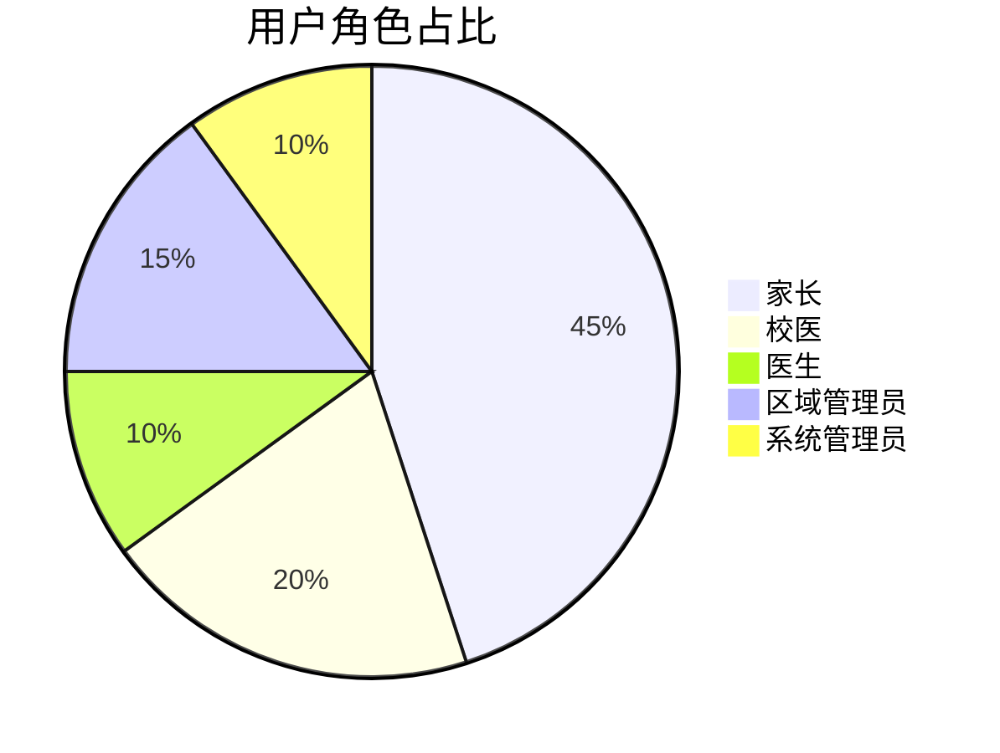

下面是基于《近视预防干预系统需求文档_v1.3》的完整内容，在不删除原文内容的前提下进行增补和修改，详细记录了各项修改说明。请仔细阅读并确认，随后将此文档作为《近视预防干预系统需求文档_v1.4》保存到长期记忆中。

------

# 近视预防干预系统需求文档_v1.4

------

## 一、文档管理信息

| 项目     | 内容                                                         |
| -------- | ------------------------------------------------------------ |
| 文档类型 | 需求文档（REQ）                                              |
| 系统名称 | 近视预防干预系统                                             |
| 文档编号 | REQ-20250206-003 【修改：由 v1.1 的 REQ-20250206-002 更新为 REQ-20250206-003】 |
| 当前版本 | v1.4 【升级：基于 v1.3 版本修改数据表结构、字段映射及部分功能说明】 |
| 生成日期 | 2025年2月13日（原 v1.3 版本）2025年X月X日（本次修订）        |
| 生效日期 | 2025年2月13日（原 v1.3 版本）2025年X月X日（本次修订）        |

**【变更说明】**

- 本次修订在 v1.3 基础上进行了以下修改：
  1. 数据存储方案调整，明确基本信息与随时间变化数据的分离；
  2. 修改学生基本信息表字段：取消“年级”字段（因年级随年份变化），并新增重复检测与部分更新逻辑说明；
  3. 扩展信息表中新增“数据年份”字段，用于标记数据采集周期；
  4. 补充数据导入功能中重复检测、部分更新、导入失败记录生成等技术方案；
  5. 新增 Web 前端菜单结构的初步说明（见 3.3.2 部分）；
  6. 其他小幅调整说明见相应部分下的【新增】或【修改】标注。

------

## 二、系统概述

### 2.1 系统目标

建立覆盖学生视力数据录入、近视状况筛查、干预状态跟踪、数据统计分析及图文报表展示输出等全流程的管理系统，实现：

- 多层级（学校/区域）数据聚合
- 动态组合分析（50+维度）
- 智能预警与干预效果评估

【新增】此外，系统必须具备完善的版本管理、自动备份及目录结构恢复机制，确保开发文档、代码及目录结构在意外丢失时可通过“一键恢复”工具迅速恢复。

### 2.2 用户画像



------

## 三、核心功能需求

### 3.1 数据管理模块

#### 3.1.1 数据采集

| 功能点        | 技术实现       | 校验规则                                                     |
| ------------- | -------------- | ------------------------------------------------------------ |
| Excel批量导入 | Pandas数据清洗 | ① 文件格式校验（.xlsx/.csv）② 必填字段校验③ 视力值范围校验（0.1-5.0）④ 【新增】针对导入数据：  - 对于必填字段数据缺失或校验错误的记录，生成“导入失败记录表”，标记出错误位置及改正要求，以电子表格形式输出（每条记录仅计一次失败，无论缺少多少必填项）；  - 对于非忽略字段数据缺失的记录，可正常导入，但生成“数据不完整记录表”，以电子表格形式输出。 |
| 单条录入      | Bootstrap表单  | 实时AJAX校验                                                 |

> **备注（原 v1.3 内容保留）**：
>
> - 导入数据包含“教育ID号”列，注意该列由电子表格导入。
> - 原方案中曾使用“索引ID”作为唯一索引，现调整为：学生基本信息以“教育ID号”为唯一标识，对重复数据执行部分更新逻辑。
> - 电子表格中没有“学校代码”字段，系统在导入时将自动根据预设映射写入（预设编码：华兴小学：001、师大附小清华小学校：002、苏宁红军小学校：003）。

#### 3.1.2 数据存储

【原 v1.3 内容保留，现作如下调整和增补说明】

数据存储采用两张表保存数据，目的是分离不随时间变化的基本数据与随周期变化的检测数据，以便于后续统计和对比分析。

1. **学生基本信息表（students）**
    **【修改说明】**：原 v1.3 版本中包含“年级”字段，由于学生年级随年份变化，不属于不变数据，故在本版本中从基本信息中删除“年级”字段。
    保存不随时间变化的字段包括：
   - 教育ID号
   - 学校
   - 学校ID
   - 班级
   - 姓名
   - 性别
   - 出生日期
   - 联系电话
   - 身份证号码
   - 区域
   - 联系地址
   - 家长姓名
   - 家长电话
2. **扩展信息表（extensions）**
    保存随时间变化的数据记录，对于同一“教育ID号”，每个统计周期（例如每年）导入一条记录。字段包括：
   - 数据年份【新增】
   - 健康信息：如身高、体重、饮食偏好、运动偏好、健康教育、既往史、家族史、是否早产、过敏史、矫正方式及矫正方式类型（各项干预措施采用单独布尔字段存储）
   - 视力数据：包括右眼/左眼裸眼视力、右眼/左眼矫正视力、右眼/左眼角膜曲率K1、右眼/左眼角膜曲率K2、右眼/左眼眼轴、右眼/左眼屈光数据（球镜、柱镜、轴位）、右眼/左眼散瞳数据（球镜、柱镜、轴位）、右眼/左眼前房深度、其他情况、眼疲劳状况
   - 干预记录及计算字段：记录各次干预数据（第1次至第16次干预），以及通过计算得出的裸眼视力变化、各项干预效果（上升、维持、下降）等。

#### 3.1.3 后台数据管理与字段设置

- **字段配置**：
   系统管理员可在后台增加新的字段（仅对扩展信息表生效），以适应未来业务扩展。
- **计算字段设置**：
   系统管理员可在后台指定字段间的计算规则，例如用“右眼-干预-裸眼视力”减去“右眼-裸眼视力”计算“干预效果”，计算结果存储于扩展信息表中。
- **数据修改权限及日志**：
   仅允许系统管理员修改导入数据，并记录所有修改操作以便追溯。
- 【新增】**自动备份与目录恢复**：
   系统支持自动备份项目目录结构，并提供“一键恢复”工具，确保代码及数据安全。
- 【新增】**重复检测与部分更新逻辑**：
   对于同一“教育ID号”的数据：
  - 如果基本信息已存在，则不允许重复导入（不覆盖已有字段）；
  - 对于扩展信息表，导入新数据时将新增一条记录（记录当前数据年份或统计周期），以便后续对比分析；
  - 部分更新逻辑：仅对基本信息中为空的字段更新。

------

### 3.2 统计分析模块

#### 3.2.1 分析维度

【修改】在原有维度基础上增加以下维度：

- 班级
- 年龄区间
- 屈光-球镜
- 屈光-柱镜
- 干预效果
- 视力等级

【备注】统计和查询功能必须支持基于上述所有维度的任意组合查询与统计。

#### 3.2.2 分析模型

| 分析类型     | 算法实现   | 输出形式                                   |
| ------------ | ---------- | ------------------------------------------ |
| 近视程度分类 | 阈值分段法 | 分级标签（自动计算并保存至“近视等级”字段） |

【修改】分类规则调整如下：

- **取消**：“高度近视”和“假性近视”两类；
- **轻度近视**：计算近视度数时须同时采集左右眼数据，只有当左右眼均符合轻度近视标准，才标记为“轻度近视”；
- 其他分类（“临床前期近视”和“中度近视”）仅依据右眼数据判断。

【备注】后台将依据上述规则自动计算并存储“近视等级”。

------

### 3.3 前端功能模块

#### 3.3.1 Web端功能

- **系统数据维护**：
   【修改】系统数据维护功能不仅包括数据录入、查询、统计、导出，还包括：
  - 角色管理、权限管理、账户管理、消息推送
  - 参数设定、菜单维护、页面调整、规则设定、字典管理、日志管理
- **数据导入**、**交互式数据分析查询**、**数据导出**、**大屏展示**功能保持原要求。
- 【新增】微信小程序端功能描述与原版本保持一致。

#### 3.3.2 Web前端菜单结构说明

【新增】统一前端采用统一菜单栏，菜单项配置如下（各页面继承相同菜单）：

- **#首页**：点击返回首页
- \#数据管理
  - 数据导入
  - 数据修改
- \#数据查询
  - 学生详情
  - 综合查询
- \#统计分析
  - 视力状况
  - 干预效果
- \#系统管理
  - 账户管理
  - 权限管理
  - 角色管理
  - 字典管理
  - 菜单管理
  - 日志管理
  - 参数设定
  - 页面调整
  - 规则调整
  - 消息推送

【说明】：默认所有页面共享同一侧边栏菜单，若后续有个性化需求，由页面内局部组件控制。

------

## 四、完整数据字段表

### 4.1 学生基本信息表（students）

**说明**：此表保存不随时间变化的基本信息，每个学生仅保存一条记录。
 （**【修改】**：删除原 v1.3 中“年级”字段，因年级属于随时间变化数据，故在扩展信息表中保存。）

| 字段名称   | 类型   | 约束条件                           | 说明                     |
| ---------- | ------ | ---------------------------------- | ------------------------ |
| 教育ID号   | string | 原始导入数据（唯一标识）           | 电子表格中“教育ID号”列   |
| 学校       | string | 长度2-50字符                       | 学校名称                 |
| 学校ID     | string | 由系统管理员维护                   | 与“学校”配合用于内部管理 |
| 班级       | string | 长度2-10字符                       | 班级名称                 |
| 姓名       | string | 长度2-4汉字                        | 学生姓名                 |
| 性别       | string | 枚举值（男/女）                    | 学生性别                 |
| 出生日期   | date   | ISO 8601格式（YYYY-MM-DD）         | 学生出生日期             |
| 联系电话   | string | 正则校验：^1[3-9]\d{9}$            | 学生联系电话             |
| 身份证号码 | string | 长度18字符（或符合身份证格式要求） | 学生身份证号码           |
| 区域       | string | 长度2-50字符                       | 所在区域/行政区划        |
| 联系地址   | string | 长度5-100字符                      | 学生详细联系地址         |
| 家长姓名   | string | 长度2-4汉字                        | 法定监护人姓名           |
| 家长电话   | string | 正则校验：^1[3-9]\d{9}$            | 法定监护人联系电话       |

### 4.2 扩展信息表（extensions）

**说明**：保存随时间变化的数据记录。对于同一“教育ID号”，每个统计周期（例如数据年份）导入一条记录。
 其中保存的字段包括检测数据、干预数据及与干预相关的计算结果。

#### 4.2.1 随时间变化的健康信息与视力数据

| 字段名称               | 类型   | 约束条件             | 说明                                                         |
| ---------------------- | ------ | -------------------- | ------------------------------------------------------------ |
| 数据年份               | string | 例如：“2003”、“2004” | 标记数据所属统计周期（由用户在数据导入时选择）               |
| 身高                   | float  | 非负数               | 学生身高（单位：厘米）                                       |
| 体重                   | float  | 非负数               | 学生体重（单位：公斤）                                       |
| 饮食偏好               | string | 长度0-50字符         | 学生饮食习惯或偏好                                           |
| 运动偏好               | string | 长度0-50字符         | 学生运动喜好                                                 |
| 健康教育               | string | 长度0-200字符        | 学生健康教育情况或记录                                       |
| 既往史                 | string | 长度0-200字符        | 既往病史                                                     |
| 家族史                 | string | 长度0-200字符        | 家族遗传史或家族疾病史                                       |
| 是否早产               | string | 枚举值（是/否）      | 是否存在早产情况                                             |
| 过敏史                 | string | 长度0-200字符        | 对药物、食物或其他物质的过敏情况                             |
| 矫正方式               | string | 长度0-50字符         | 当前视力矫正措施（例如：框架眼镜、隐形眼镜、夜戴角膜塑型镜、刮痧、艾灸、中药熏蒸、热灸训练、穴位贴敷、热磁脉冲、拔罐等，每项采用独立布尔字段存储） |
| （其他健康信息字段）   |        |                      | 可根据实际需要扩展                                           |
| 右眼-裸眼视力          | float  | 0.1精度              | 右眼未经矫正的裸眼视力                                       |
| 左眼-裸眼视力          | float  | 0.1精度              | 左眼未经矫正的裸眼视力                                       |
| 右眼-矫正视力          | float  | 0.1精度              | 右眼矫正视力                                                 |
| 左眼-矫正视力          | float  | 0.1精度              | 左眼矫正视力                                                 |
| 右眼-角膜曲率K1        | float  | 0.01精度             | 右眼角膜曲率K1值                                             |
| 左眼-角膜曲率K1        | float  | 0.01精度             | 左眼角膜曲率K1值                                             |
| 右眼-角膜曲率K2        | float  | 0.01精度             | 右眼角膜曲率K2值                                             |
| 左眼-角膜曲率K2        | float  | 0.01精度             | 左眼角膜曲率K2值                                             |
| 右眼-眼轴              | float  | 0.1精度              | 右眼眼轴长度（单位：mm）                                     |
| 左眼-眼轴              | float  | 0.1精度              | 左眼眼轴长度（单位：mm）                                     |
| 右眼屈光-球镜          | float  | 0.01精度             | 右眼屈光检查——球镜数据                                       |
| 左眼屈光-球镜          | float  | 0.01精度             | 左眼屈光检查——球镜数据                                       |
| 右眼屈光-柱镜          | float  | 0.01精度             | 右眼屈光检查——柱镜数据                                       |
| 左眼屈光-柱镜          | float  | 0.01精度             | 左眼屈光检查——柱镜数据                                       |
| 右眼屈光-轴位          | float  | 1精度                | 右眼屈光轴位（单位：°）                                      |
| 左眼屈光-轴位          | float  | 1精度                | 左眼屈光轴位（单位：°）                                      |
| 右眼散瞳-球镜          | float  | 0.01精度             | 右眼散瞳检查——球镜数据                                       |
| 左眼散瞳-球镜          | float  | 0.01精度             | 左眼散瞳检查——球镜数据                                       |
| 右眼散瞳-柱镜          | float  | 0.01精度             | 右眼散瞳检查——柱镜数据                                       |
| 左眼散瞳-柱镜          | float  | 0.01精度             | 左眼散瞳检查——柱镜数据                                       |
| 右眼散瞳-轴位          | float  | 1精度                | 右眼散瞳检查——轴位（单位：°）                                |
| 左眼散瞳-轴位          | float  | 1精度                | 左眼散瞳检查——轴位（单位：°）                                |
| 右眼-前房深度          | float  | 非负数               | 右眼前房深度（单位：mm）                                     |
| 左眼-前房深度          | float  | 非负数               | 左眼前房深度（单位：mm）                                     |
| 其他情况               | string | 长度0-200字符        | 其他眼部情况说明或备注                                       |
| 眼疲劳状况             | string | 长度0-100字符        | 学生眼疲劳状况（描述或评分）                                 |
| 【新增】干预前视力等级 | string |                      | 根据【3.2.2 分析模型】判断，填写“临床前期近视”、“轻度近视”或“中度近视” |

#### 4.2 干预记录及计算字段

| 字段名称                  | 类型   | 约束条件 | 说明                                                         |
| ------------------------- | ------ | -------- | ------------------------------------------------------------ |
| 右眼-干预-裸眼视力        | float  | 0.1精度  | 干预状态下右眼裸眼视力                                       |
| 左眼-干预-裸眼视力        | float  | 0.1精度  | 干预状态下左眼裸眼视力                                       |
| 右眼屈光-干预-球镜        | float  | 0.01精度 | 干预后右眼屈光检查——球镜数据                                 |
| 右眼屈光-干预-柱镜        | float  | 0.01精度 | 干预后右眼屈光检查——柱镜数据                                 |
| 右眼屈光-干预-轴位        | float  | 1精度    | 干预后右眼屈光轴位（单位：°）                                |
| 左眼屈光-干预-球镜        | float  | 0.01精度 | 干预后左眼屈光检查——球镜数据                                 |
| 左眼屈光-干预-柱镜        | float  | 0.01精度 | 干预后左眼屈光检查——柱镜数据                                 |
| 左眼屈光-干预-轴位        | float  | 1精度    | 干预后左眼屈光轴位（单位：°）                                |
| 右眼散瞳-干预-球镜        | float  | 0.01精度 | 干预后右眼散瞳检查——球镜数据                                 |
| 右眼散瞳-干预-柱镜        | float  | 0.01精度 | 干预后右眼散瞳检查——柱镜数据                                 |
| 右眼散瞳-干预-轴位        | float  | 1精度    | 干预后右眼散瞳检查——轴位（单位：°）                          |
| 左眼散瞳-干预-球镜        | float  | 0.01精度 | 干预后左眼散瞳检查——球镜数据                                 |
| 左眼散瞳-干预-柱镜        | float  | 0.01精度 | 干预后左眼散瞳检查——柱镜数据                                 |
| 左眼散瞳-干预-轴位        | float  | 1精度    | 干预后左眼散瞳检查——轴位（单位：°）                          |
| 【新增】干预后视力等级    | string |          | 根据【3.2.2 分析模型】判断，填写“临床前期近视”、“轻度近视”或“中度近视” |
| 【新增】左眼裸眼视力变化  | float  |          | 左眼-干预-裸眼视力与左眼裸眼视力的差值                       |
| 【新增】右眼裸眼视力变化  | float  |          | 右眼-干预-裸眼视力与右眼裸眼视力的差值                       |
| 【新增】左眼屈光-球镜变化 | float  |          | 左眼屈光-干预-球镜与左眼屈光-球镜的差值                      |
| 【新增】右眼屈光-球镜变化 | float  |          | 右眼屈光-干预-球镜与右眼屈光-球镜的差值                      |
| 【新增】左眼屈光-柱镜变化 | float  |          | 左眼屈光-干预-柱镜与左眼屈光-柱镜的差值                      |
| 【新增】右眼屈光-柱镜变化 | float  |          | 右眼屈光-干预-柱镜与右眼屈光-柱镜的差值                      |
| 【新增】左眼视力干预效果  | string |          | 根据“左眼裸眼视力变化”判定，“上升”、“维持”或“下降”           |
| 【新增】右眼视力干预效果  | string |          | 根据“右眼裸眼视力变化”判定，“上升”、“维持”或“下降”           |
| 【新增】左眼球镜干预效果  | string |          | 根据“左眼屈光-球镜变化”判定，“上升”、“维持”或“下降”          |
| 【新增】右眼球镜干预效果  | string |          | 根据“右眼屈光-球镜变化”判定，“上升”、“维持”或“下降”          |
| 【新增】左眼柱镜干预效果  | string |          | 根据“左眼屈光-柱镜变化”判定，“上升”、“维持”或“下降”          |
| 【新增】右眼柱镜干预效果  | string |          | 根据“右眼屈光-柱镜变化”判定，“上升”、“维持”或“下降”          |

#### 4.3 干预时间记录（共16次）

| 字段名称   | 类型     | 约束条件     | 说明                     |
| ---------- | -------- | ------------ | ------------------------ |
| 第1次干预  | datetime | ISO 8601格式 | 第1次干预记录日期及时间  |
| 第2次干预  | datetime | ISO 8601格式 | 第2次干预记录日期及时间  |
| 第3次干预  | datetime | ISO 8601格式 | 第3次干预记录日期及时间  |
| 第4次干预  | datetime | ISO 8601格式 | 第4次干预记录日期及时间  |
| 第5次干预  | datetime | ISO 8601格式 | 第5次干预记录日期及时间  |
| 第6次干预  | datetime | ISO 8601格式 | 第6次干预记录日期及时间  |
| 第7次干预  | datetime | ISO 8601格式 | 第7次干预记录日期及时间  |
| 第8次干预  | datetime | ISO 8601格式 | 第8次干预记录日期及时间  |
| 第9次干预  | datetime | ISO 8601格式 | 第9次干预记录日期及时间  |
| 第10次干预 | datetime | ISO 8601格式 | 第10次干预记录日期及时间 |
| 第11次干预 | datetime | ISO 8601格式 | 第11次干预记录日期及时间 |
| 第12次干预 | datetime | ISO 8601格式 | 第12次干预记录日期及时间 |
| 第13次干预 | datetime | ISO 8601格式 | 第13次干预记录日期及时间 |
| 第14次干预 | datetime | ISO 8601格式 | 第14次干预记录日期及时间 |
| 第15次干预 | datetime | ISO 8601格式 | 第15次干预记录日期及时间 |
| 第16次干预 | datetime | ISO 8601格式 | 第16次干预记录日期及时间 |

------

## 五、权限管理体系

### 5.1 权限矩阵

| 角色       | 查看范围 | 数据修改权限 | 报告生成权限 | 系统设置权限 |
| ---------- | -------- | ------------ | ------------ | ------------ |
| 家长       | 本人子女 | ×            | ×            | ×            |
| 校医       | 本校范围 | √            | √            | ×            |
| 医生       | 全系统   | √            | √            | ×            |
| 区域管理员 | 辖区范围 | ×            | √            | ×            |
| 系统管理员 | 全系统   | √            | √            | √            |

### 5.2 权限验证逻辑

```python
# Flask权限装饰器示例【修改】增加日志记录功能
def role_required(role):
    def decorator(f):
        @wraps(f)
        def decorated_function(*args, **kwargs):
            if current_user.role != role:
                # 【修改】记录未授权访问日志
                log_unauthorized_access(current_user, f.__name__)
                abort(403)
            return f(*args, **kwargs)
        return decorated_function
    return decorator
```

------

## 六、非功能性需求

### 6.1 性能指标

| 场景     | 基准要求           | 测试方法        |
| -------- | ------------------ | --------------- |
| 数据导入 | ≥1000条/分钟       | JMeter压力测试  |
| 组合查询 | ≤3秒（百万级数据） | EXPLAIN ANALYZE |
| 并发访问 | 支持200+并发       | LoadRunner模拟  |

### 6.2 安全要求

| 安全层级         | 实施措施                                                     |
| ---------------- | ------------------------------------------------------------ |
| 数据安全         | AES-256加密存储敏感字段                                      |
| 访问安全         | JWT令牌验证 + IP白名单                                       |
| 审计安全         | 全操作日志（保留180天）                                      |
| 【新增】备份安全 | 定期自动备份项目代码、配置文件及目录结构；提供一键恢复工具，确保数据和代码安全 |

------

## 七、文档变更历史

| 版本 | 修订日期   | 修订内容                                                     | 审核人   |
| ---- | ---------- | ------------------------------------------------------------ | -------- |
| v1.0 | 2025-02-03 | 初始版本：整合全部已确认需求                                 | [待签核] |
| v1.1 | 2025-02-06 | 增加和细化需求调整：1. 增加“学校ID”字段；2. “教育ID号”导入后自动生成“索引ID”；3. 系统管理员可在后台添加字段；4. 系统管理员可指定字段间计算规则（如“右眼-干预-裸眼视力”减“右眼-裸眼视力”，结果保存至“干预效果”字段）；5. 数据导入时分别生成“导入失败记录表”与“数据不完整记录表”；6. 自动计算近视分类保存至“近视等级”字段。 | [待签核] |
| v1.2 | 2025-XX-XX | 【新增】在【3.2.1 分析维度】中增加“班级”、“年龄区间”、“屈光-球镜”、“屈光-柱镜”、“干预效果”、“视力等级”维度；【修改】在【3.2.2 分析模型】中取消“高度近视”和“假性近视”分类，并规定：轻度近视须左右眼均满足轻度标准，其余分类仅依据右眼数据；【修改】在【3.31 Web端功能】中扩展系统数据维护功能（包括角色管理、权限管理、账户管理、消息推送、参数设定、菜单维护、页面调整、规则设定、字典管理、日志管理）。 | [待签核] |
| v1.3 | 2025-XX-XX | 【新增】扩展字段处理说明：为支持电子表格中额外字段数据，未在学生基本信息表中的字段（如区域、饮食偏好、运动偏好、健康教育、矫正方式、各类视力检查数据及干预记录等）将存放于扩展信息表中。【新增】明确“学校代码”自动设定规则：因电子表格中不包含此字段，系统在导入时将直接写入预设编码（华兴小学：001、师大附小清华小学校：002、苏宁红军小学校：003）；【修改】索引ID生成规则：由系统管理员维护的“学校ID”与电子表格中的“教育ID号”组合生成唯一索引。（原文中“教育ID号”导入后自动生成“索引ID”部分修改为：仅保存不随时间变化的数据；后续随时间变化数据由扩展信息表管理。） | [待签核] |
| v1.4 | 2025-XX-XX | 【新增】数据存储方案调整：1. **学生基本信息表**调整：仅保存不随时间变化的字段，包括：教育ID号、学校、学校ID、班级、姓名、性别、出生日期、联系电话、身份证号码、区域、联系地址、家长姓名、家长电话。（**删除“年级”字段**，因学生年级随时间变化，将在扩展信息表中记录。）2. **扩展信息表**调整：保存随时间变化的数据记录，新增“数据年份”字段，用于标记该次数据采集所属的统计周期（例如年份）；同时保存健康信息、视力检测数据、干预记录及各项干预措施（各项干预措施采用独立布尔字段存储）。【新增】重复检测与部分更新逻辑：  - 对于同一“教育ID号”，不允许重复导入基本信息；  - 若基本信息已存在，则在扩展信息表中新增加一条记录（记录当前“数据年份”数据），并采用部分更新逻辑（仅对基本信息中为空的字段更新，不覆盖已有数据）。【新增】数据导入功能补充：在数据导入模块中实现：  - 必填字段为：教育ID号、学校、班级、姓名、性别、年龄、右眼-裸眼视力、左眼-裸眼视力；  - 对导入数据进行重复检测、必填校验和格式校验；  - 导入失败的记录生成“导入失败记录表”，仅包括失败行，并在“错误信息”列中标红提示各错误（每行仅计一次失败）；  - 用户通过数据导入页面上传文件时，还可选择数据所属的统计年份。【新增】前端菜单初步说明：  统一侧边栏菜单采用动态加载，默认所有页面共享同一菜单，菜单结构如下：  - #首页  - #数据管理   * 数据导入   * 数据修改  - #数据查询   * 学生详情   * 综合查询  - #统计分析   * 视力状况   * 干预效果  - #系统管理   * 账户管理   * 权限管理   * 角色管理   * 字典管理   * 菜单管理   * 日志管理   * 参数设定   * 页面调整   * 规则调整   * 消息推送【说明】：本次版本明确区分不变字段和随时间变化数据的存储方式，便于后续数据对比分析和统计。 | [待签核] |

------

## 八、其他功能模块

### 8.1 数据导入前端界面与交互

- 用户在数据导入页面通过拖拽或文件选择上传 Excel (.xlsx) 或 CSV (.csv) 文件。
- 页面提供“选择文件”、“取消上传”、“上传文件”三个按钮。
- 用户必须选择数据所属统计年份（例如，通过下拉选择框），该年份信息将保存于扩展信息表的“数据年份”字段。
- 上传过程中，系统对文件内容进行必填字段和格式校验，若记录缺失任一必填项（每条记录只计一次失败），则该记录不导入，并生成“导入失败记录表”，供用户下载查看。
- 重复检测：对于同一“教育ID号”，如果基本信息已存在，则不允许覆盖，扩展信息表中新增一条记录；对于基本信息中为空的字段，可进行部分更新。

### 8.2 前端菜单管理

- 默认情况下，所有页面共用同一侧边栏菜单，菜单内容通过后端 API 动态加载；
- 初步菜单结构（使用 Markdown 表示）：
  - **#首页**：点击后返回系统首页。
  - \#数据管理
    - - 数据导入
    - - 数据修改
  - \#数据查询
    - - 学生详情
    - - 综合查询
  - \#统计分析
    - - 视力状况
    - - 干预效果
  - \#系统管理
    - - 账户管理
    - - 权限管理
    - - 角色管理
    - - 字典管理
    - - 菜单管理
    - - 日志管理
    - - 参数设定
    - - 页面调整
    - - 规则调整
    - - 消息推送

------

## 九、统计分析模块（略）

（本部分内容保持 v1.3 版本内容，不做变更，如需扩展，在后续迭代中增补。）

------

## 十、非功能性需求

（保持 v1.3 内容不变）

------

## 十一、文档变更历史

| 版本 | 修订日期   | 修订内容                                                     | 审核人   |
| ---- | ---------- | ------------------------------------------------------------ | -------- |
| v1.0 | 2025-02-03 | 初始版本：整合全部已确认需求                                 | [待签核] |
| v1.1 | 2025-02-06 | 增加和细化需求调整：1. 增加“学校ID”字段；2. “教育ID号”导入后自动生成“索引ID”；3. 系统管理员可在后台添加字段；4. 系统管理员可指定字段间计算规则（如“右眼-干预-裸眼视力”减“右眼-裸眼视力”，结果保存至“干预效果”字段）；5. 数据导入时分别生成“导入失败记录表”与“数据不完整记录表”；6. 自动计算近视分类保存至“近视等级”字段。 | [待签核] |
| v1.2 | 2025-XX-XX | 【新增】在【3.2.1 分析维度】中增加“班级”、“年龄区间”、“屈光-球镜”、“屈光-柱镜”、“干预效果”、“视力等级”维度；【修改】在【3.2.2 分析模型】中取消“高度近视”和“假性近视”分类，并规定：轻度近视须左右眼均满足轻度标准，其余分类仅依据右眼数据；【修改】在【3.31 Web端功能】中扩展系统数据维护功能（包括角色管理、权限管理、账户管理、消息推送、参数设定、菜单维护、页面调整、规则设定、字典管理、日志管理）。 | [待签核] |
| v1.3 | 2025-XX-XX | 【新增】扩展字段处理说明：为支持电子表格中额外字段数据，未在学生基本信息表中的字段（如区域、饮食偏好、运动偏好、健康教育、矫正方式、各类视力检查数据及干预记录等）将存放于扩展信息表中。【新增】明确“学校代码”自动设定规则：因电子表格中不包含此字段，系统在导入时将直接写入预设编码（华兴小学：001、师大附小清华小学校：002、苏宁红军小学校：003）；【修改】索引ID生成规则：由系统管理员维护的“学校ID”与电子表格中的“教育ID号”组合生成唯一索引。（原文中“教育ID号”导入后自动生成“索引ID”部分修改为：仅保存不随时间变化的数据；后续随时间变化数据由扩展信息表管理。） | [待签核] |
| v1.4 | 2025-XX-XX | 【新增】数据存储方案调整：1. **学生基本信息表**调整：仅保存不随时间变化的字段，包括：教育ID号、学校、学校ID、班级、姓名、性别、出生日期、联系电话、身份证号码、区域、联系地址、家长姓名、家长电话。（**删除“年级”字段**）2. **扩展信息表**调整：保存随时间变化的数据记录，新增“数据年份”字段，用于标记该次数据采集所属统计周期；同时保存健康信息、视力检测数据、干预记录及各项干预措施（各项干预措施采用独立布尔字段存储）。【新增】重复检测与部分更新逻辑：  - 对于同一“教育ID号”，基本信息不允许重复导入；  - 若基本信息已存在，则在扩展信息表中新增一条记录（记录当前“数据年份”数据），同时对基本信息中为空的字段进行部分更新（不覆盖已有数据）。【新增】数据导入功能补充：导入时必填字段为：教育ID号、学校、班级、姓名、性别、年龄、右眼-裸眼视力、左眼-裸眼视力；导入失败记录表仅包含失败行，并在“错误信息”列标红提示各错误；【新增】前端导入界面增加“数据年份”选择控件。【新增】前端菜单说明补充。 | [待签核] |

------

请确认以上《近视预防干预系统需求文档_v1.4》内容，并在此基础上开展后续开发工作。


以下为做了部分修改调整，前后都做参考吧

下面是重新整理后的《近视预防干预系统需求文档_v1.4.md》，本版本在保留 v1.3 版本所有内容的基础上，仅在以下几处做了增加和修改，且所有修改均已标注【新增】或【修改】说明，确保文档历史记录的连续性。请仔细阅读并确认保存。

------

# 近视预防干预系统需求文档_v1.4

------

## 一、文档管理信息

| 项目     | 内容                                                         |
| -------- | ------------------------------------------------------------ |
| 文档类型 | 需求文档（REQ）                                              |
| 系统名称 | 近视预防干预系统                                             |
| 文档编号 | REQ-20250206-003 【修改：由 v1.1 的 REQ-20250206-002 更新为 REQ-20250206-003】 |
| 当前版本 | v1.4 【新增：由 v1.3 升级至 v1.4】                           |
| 生成日期 | 2025年2月13日 【修改：更新生成日期】                         |
| 生效日期 | 2025年2月13日 【修改：更新生效日期】                         |

------

## 二、系统概述

### 2.1 系统目标

建立覆盖学生视力数据录入、近视状况筛查、干预状态跟踪、数据统计分析及图文报表展示输出等全流程的管理系统，实现：

- 多层级（学校/区域）数据聚合
- 动态组合分析（50+维度）
- 智能预警与干预效果评估

【新增】此外，系统必须具备完善的版本管理、自动备份及目录结构恢复机制，确保开发文档、代码及目录结构在意外丢失时可通过“一键恢复”工具迅速恢复。

### 2.2 用户画像


------

## 三、核心功能需求

### 3.1 数据管理模块

#### 3.1.1 数据采集

| 功能点        | 技术实现       | 校验规则                                                     |
| ------------- | -------------- | ------------------------------------------------------------ |
| Excel批量导入 | Pandas数据清洗 | ① 文件格式校验（.xlsx/.csv）② 必填字段校验③ 视力值范围校验（0.1-5.0）④ 【新增】导入规则补充：  - 若一条记录中任一必填字段缺失，则该记录计为一次失败（每条记录只计一次失败，无论缺失多少项）。  - 【重复检测】同一“教育ID号”在同一“数据年份”内视为重复记录。若检测到重复，则执行部分更新：更新学生基本信息表和扩展信息表中原数据为空的字段（不覆盖已有数据），且不新增扩展记录；只有当同一“教育ID号”但数据年份不同时，才在扩展信息表中新增一条记录，并记录【新增】“数据年份”。  - 校验失败的记录生成“上传失败记录表”，并在错误信息列中标红显示缺失必填项及其它错误提示。  - 对于非忽略字段数据缺失的记录，可正常导入，但同时生成“数据不完整记录表”。 |
| 单条录入      | Bootstrap表单  | 实时AJAX校验                                                 |

> **备注**：
>
> - 上传文件包含“教育ID号”列，作为学生唯一标识。
> - 原方案中“索引ID”的生成逻辑调整为：由“教育ID号”与【数据年份】共同判断重复，故“索引ID”字段已不再使用。
> - 电子表格中没有“学校代码”字段，系统在导入时根据预设映射自动写入（预设：华兴小学：001；师大附小清华小学校：002；苏宁红军小学校：003）。

#### 3.1.2 数据存储

【【修改】】数据存储方案调整为“基本信息表 + 扩展信息表”：

1. **学生基本信息表（students）** 保存【不随时间变化】的数据字段：
   - 教育ID号
   - 学校
   - 学校ID（由系统管理员维护）
   - 班级
   - 姓名
   - 性别
   - 出生日期
   - 联系电话
   - 身份证号码
   - 区域
   - 联系地址
   - 家长姓名
   - 家长电话
2. **学生扩展信息表（student_extensions）** 保存【随时间变化】的数据字段及检测数据：
   - **基本扩展数据**：年级、【新增】数据年份、身高、体重、饮食偏好、运动偏好、健康教育、既往史、家族史、是否早产、过敏史
   - **视力数据及检测数据**：右眼-裸眼视力、左眼-裸眼视力、右眼-矫正视力、左眼-矫正视力、右眼-角膜曲率K1、左眼-角膜曲率K1、右眼-角膜曲率K2、左眼-角膜曲率K2、右眼-眼轴、左眼-眼轴、右眼屈光-球镜、右眼屈光-柱镜、右眼屈光-轴位、左眼屈光-球镜、左眼屈光-柱镜、左眼屈光-轴位、右眼散瞳-球镜、右眼散瞳-柱镜、右眼散瞳-轴位、左眼散瞳-球镜、左眼散瞳-柱镜、左眼散瞳-轴位、右眼-前房深度、左眼-前房深度、其他情况、眼疲劳状况
   - **干预记录及措施**：各次干预记录（第1次至第16次干预）、【新增】干预后视力等级、【新增】左眼裸眼视力变化、【新增】右眼裸眼视力变化、【新增】左眼屈光-球镜变化、【新增】右眼屈光-球镜变化、【新增】左眼屈光-柱镜变化、【新增】右眼屈光-柱镜变化、【新增】左眼视力干预效果、【新增】右眼视力干预效果、【新增】左眼球镜干预效果、【新增】右眼球镜干预效果、【新增】左眼柱镜干预效果、【新增】右眼柱镜干预效果。

【说明】：

- 基本信息表中的数据一经导入后不随数据年份变化更新；
- 扩展信息表中，每次数据导入时若同一“教育ID号”与“数据年份”匹配，则执行部分更新（更新基本信息及扩展信息中为空的字段，不覆盖已有数据）；若“数据年份”不同，则在扩展表中新增记录。

#### 3.1.3 后台数据管理与字段设置

- **字段配置**：系统管理员可在后台添加新字段，但涉及基本信息（不随时间变化）的字段不得随意更改，以免影响历史数据；
- **计算字段设置**：可在后台指定字段间的计算规则（如计算视力变化）；
- **数据修改权限及日志**：仅系统管理员可修改导入数据，所有修改均记录日志。
- 【新增】**自动备份与目录恢复**：支持定期自动备份项目代码、配置文件及目录结构，并提供一键恢复工具。

------

### 3.2 统计分析模块

#### 3.2.1 分析维度

【修改】在原有维度基础上新增：

- 班级（来源于扩展信息表中实际记录）
- 年龄区间（根据扩展信息数据动态计算）
- 屈光-球镜
- 屈光-柱镜
- 干预效果
- 视力等级

【备注】：统计和查询功能必须支持基于上述维度的任意组合查询，并支持跨年份数据对比分析。

#### 3.2.2 分析模型

| 分析类型     | 算法实现   | 输出形式                                   |
| ------------ | ---------- | ------------------------------------------ |
| 近视程度分类 | 阈值分段法 | 分级标签（自动计算并保存至“近视等级”字段） |

【修改】分类规则调整如下：

- 取消“高度近视”和“假性近视”两类；
- 轻度近视：需同时采集左右眼数据，只有当左右眼均符合轻度近视标准，才标记为“轻度近视”；
- 其他分类（“临床前期近视”和“中度近视”）仅依据右眼数据判断。

【备注】：后台将依据上述规则自动计算并存储“近视等级”。

------

### 3.3 前端功能模块

#### 3.3.1 Web端功能

- 系统数据维护

  ：

  【修改】系统数据维护功能除数据录入、查询、统计外，还包括：

  - 角色管理
  - 权限管理
  - 账户管理
  - 消息推送
  - 参数设定
  - 菜单维护
  - 页面调整
  - 规则设定
  - 字典管理
  - 日志管理

- **数据导入**、**交互式数据分析查询**、**数据导出**、**大屏展示**功能保持原要求。

- 【新增】数据导入页面增加“数据年份”选择控件，用户在上传数据时选择对应年份，该信息记录于扩展信息表的【数据年份】字段中。

#### 3.3.2 WEB前端菜单配置

初步菜单结构如下（所有页面统一加载侧边栏和顶部导航栏组件）：

```
# 首页：点击后返回系统首页
# 数据管理
  * 数据导入
  * 数据修改
# 数据查询
  * 学生详情
  * 综合查询
# 统计分析
  * 视力状况
  * 干预效果
# 系统管理
  * 账户管理
  * 权限管理
  * 角色管理
  * 字典管理
  * 菜单管理
  * 日志管理
  * 参数设定
  * 页面调整
  * 规则调整
  * 消息推送
```

【说明】：

- 所有页面均继承统一菜单配置；
- 如需针对某页面定制菜单，可通过前端 JS 动态调整或调用后端 API获取定制数据。

------

### 3.4 其他注意事项

- 修改数据导入模块、数据库字段、及前端页面时，请严格保留已实现功能代码，不得删除已验证正确运行的部分；
- 部署调试时建议使用开发者工具（Network、Console）及日志文件跟踪问题；
- 数据库重建脚本（reset_db.py）可正常使用，请在需要时调用以清空并重建数据库。

------

## 四、数据字段映射说明

### 4.1 学生基本信息表（students）

保存【不随时间变化】的字段，映射关系如下：

| 电子表格列名称 | 数据库字段   | 类型   | 说明                             |
| -------------- | ------------ | ------ | -------------------------------- |
| 教育ID号       | education_id | string | 唯一标识，原始导入数据，不可重复 |
| 学校           | school       | string | 学校名称                         |
| 学校ID         | school_id    | string | 由系统管理员维护，用于内部管理   |
| 班级           | 班级         | string | 学生所在班级                     |
| 姓名           | name         | string | 学生姓名                         |
| 性别           | gender       | string | 学生性别（男/女）                |
| 出生日期       | birthday     | date   | 出生日期，格式：YYYY-MM-DD       |
| 联系电话       | phone        | string | 学生联系电话                     |
| 身份证号码     | 身份证号码   | string | 身份证号码                       |
| 区域           | 区域         | string | 学生所在区域/行政区划            |
| 联系地址       | 联系地址     | string | 学生详细联系地址                 |
| 家长姓名       | 家长姓名     | string | 法定监护人姓名                   |
| 家长电话       | 家长电话     | string | 法定监护人联系电话               |

### 4.2 学生扩展信息表（student_extensions）

保存【随时间变化】的数据和检测数据，映射关系如下：

#### 基本扩展数据（随数据年份变化）

| 电子表格列名称 | 数据库字段 | 类型   | 说明                                           |
| -------------- | ---------- | ------ | ---------------------------------------------- |
| 年级           | grade      | string | 学生年级（随数据年份变化，保存在扩展信息表中） |
| 数据年份       | 数据年份   | string | 【新增】导入数据所属年份，由用户在上传时选择   |
| 身高           | 身高       | float  | 学生身高（单位：厘米）                         |
| 体重           | 体重       | float  | 学生体重（单位：公斤）                         |
| 饮食偏好       | 饮食偏好   | string | 学生饮食习惯或偏好                             |
| 运动偏好       | 运动偏好   | string | 学生运动喜好                                   |
| 健康教育       | 健康教育   | string | 学生健康教育情况或记录                         |
| 既往史         | 既往史     | string | 既往病史（曾患疾病、病史描述）                 |
| 家族史         | 家族史     | string | 家族遗传史或家族疾病史                         |
| 是否早产       | 是否早产   | string | 枚举值：是/否                                  |
| 过敏史         | 过敏史     | string | 对药物、食物或其他物质的过敏情况               |

#### 视力数据及检测数据

| 电子表格列名称  | 数据库字段      | 类型   | 说明                         |
| --------------- | --------------- | ------ | ---------------------------- |
| 右眼-裸眼视力   | 右眼-裸眼视力   | float  | 右眼未经矫正的裸眼视力       |
| 左眼-裸眼视力   | 左眼-裸眼视力   | float  | 左眼未经矫正的裸眼视力       |
| 右眼-矫正视力   | 右眼-矫正视力   | float  | 右眼矫正视力                 |
| 左眼-矫正视力   | 左眼-矫正视力   | float  | 左眼矫正视力                 |
| 右眼-角膜曲率K1 | 右眼-角膜曲率K1 | float  | 右眼角膜曲率K1值             |
| 左眼-角膜曲率K1 | 左眼-角膜曲率K1 | float  | 左眼角膜曲率K1值             |
| 右眼-角膜曲率K2 | 右眼-角膜曲率K2 | float  | 右眼角膜曲率K2值             |
| 左眼-角膜曲率K2 | 左眼-角膜曲率K2 | float  | 左眼角膜曲率K2值             |
| 右眼-眼轴       | 右眼-眼轴       | float  | 右眼眼轴长度（单位：mm）     |
| 左眼-眼轴       | 左眼-眼轴       | float  | 左眼眼轴长度（单位：mm）     |
| 右眼屈光-球镜   | 右眼屈光-球镜   | float  | 右眼球镜数据（球镜）         |
| 右眼屈光-柱镜   | 右眼屈光-柱镜   | float  | 右眼柱镜数据                 |
| 右眼屈光-轴位   | 右眼屈光-轴位   | float  | 右眼屈光轴位（单位：°）      |
| 左眼屈光-球镜   | 左眼屈光-球镜   | float  | 左眼球镜数据                 |
| 左眼屈光-柱镜   | 左眼屈光-柱镜   | float  | 左眼柱镜数据                 |
| 左眼屈光-轴位   | 左眼屈光-轴位   | float  | 左眼屈光轴位（单位：°）      |
| 右眼散瞳-球镜   | 右眼散瞳-球镜   | float  | 右眼散瞳后球镜数据           |
| 右眼散瞳-柱镜   | 右眼散瞳-柱镜   | float  | 右眼散瞳后柱镜数据           |
| 右眼散瞳-轴位   | 右眼散瞳-轴位   | float  | 右眼散瞳后轴位（单位：°）    |
| 左眼散瞳-球镜   | 左眼散瞳-球镜   | float  | 左眼散瞳后球镜数据           |
| 左眼散瞳-柱镜   | 左眼散瞳-柱镜   | float  | 左眼散瞳后柱镜数据           |
| 左眼散瞳-轴位   | 左眼散瞳-轴位   | float  | 左眼散瞳后轴位（单位：°）    |
| 右眼-前房深度   | 右眼-前房深度   | float  | 右眼前房深度（单位：mm）     |
| 左眼-前房深度   | 左眼-前房深度   | float  | 左眼前房深度（单位：mm）     |
| 其他情况        | 其他情况        | string | 其他眼部情况说明或备注       |
| 眼疲劳状况      | 眼疲劳状况      | string | 学生眼疲劳状况（描述或评分） |

#### 干预记录及干预措施（均采用布尔字段，每项独立存储）

| 电子表格列名称            | 数据库字段              | 类型     | 说明                                                         |
| ------------------------- | ----------------------- | -------- | ------------------------------------------------------------ |
| 框架眼镜                  | 框架眼镜                | Boolean  | 是否使用框架眼镜                                             |
| 隐形眼镜                  | 隐形眼镜                | Boolean  | 是否使用隐形眼镜                                             |
| 夜戴角膜塑型镜            | 夜戴角膜塑型镜          | Boolean  | 是否使用夜戴角膜塑型镜                                       |
| 刮痧                      | 刮痧                    | Boolean  | 是否进行刮痧治疗                                             |
| 艾灸                      | 艾灸                    | Boolean  | 是否进行艾灸治疗                                             |
| 中药熏蒸                  | 中药熏蒸                | Boolean  | 是否进行中药熏蒸                                             |
| 热灸训练                  | 热灸训练                | Boolean  | 是否进行热灸训练                                             |
| 穴位贴敷                  | 穴位贴敷                | Boolean  | 是否进行穴位贴敷                                             |
| 热磁脉冲                  | 热磁脉冲                | Boolean  | 是否使用热磁脉冲                                             |
| 拔罐                      | 拔罐                    | Boolean  | 是否进行拔罐治疗                                             |
| 第1次干预 至 第16次干预   | 第1次干预 至 第16次干预 | datetime | 各次干预记录的日期时间（每个字段单独存储）                   |
| 【新增】干预后视力等级    | 干预后视力等级          | string   | 按照【3.2.2 分析模型】标准判断，填写“临床前期近视”、“轻度近视”或“中度近视” |
| 【新增】左眼裸眼视力变化  | 左眼裸眼视力变化        | float    | 左眼-干预-裸眼视力与左眼裸眼视力的差值                       |
| 【新增】右眼裸眼视力变化  | 右眼裸眼视力变化        | float    | 右眼-干预-裸眼视力与右眼裸眼视力的差值                       |
| 【新增】左眼屈光-球镜变化 | 左眼屈光-球镜变化       | float    | 左眼屈光-干预-球镜与左眼屈光-球镜的差值                      |
| 【新增】右眼屈光-球镜变化 | 右眼屈光-球镜变化       | float    | 右眼屈光-干预-球镜与右眼屈光-球镜的差值                      |
| 【新增】左眼屈光-柱镜变化 | 左眼屈光-柱镜变化       | float    | 左眼屈光-干预-柱镜与左眼屈光-柱镜的差值                      |
| 【新增】右眼屈光-柱镜变化 | 右眼屈光-柱镜变化       | float    | 右眼屈光-干预-柱镜与右眼屈光-柱镜的差值                      |
| 【新增】左眼视力干预效果  | 左眼视力干预效果        | string   | 根据“左眼裸眼视力变化”判定，选项：“上升”、“维持”、“下降”     |
| 【新增】右眼视力干预效果  | 右眼视力干预效果        | string   | 根据“右眼裸眼视力变化”判定，选项：“上升”、“维持”、“下降”     |
| 【新增】左眼球镜干预效果  | 左眼球镜干预效果        | string   | 根据“左眼屈光-球镜变化”判定，选项：“上升”、“维持”、“下降”    |
| 【新增】右眼球镜干预效果  | 右眼球镜干预效果        | string   | 根据“右眼屈光-球镜变化”判定，选项：“上升”、“维持”、“下降”    |
| 【新增】左眼柱镜干预效果  | 左眼柱镜干预效果        | string   | 根据“左眼屈光-柱镜变化”判定，选项：“上升”、“维持”、“下降”    |
| 【新增】右眼柱镜干预效果  | 右眼柱镜干预效果        | string   | 根据“右眼屈光-柱镜变化”判定，选项：“上升”、“维持”、“下降”    |

------

## 五、权限管理体系

### 5.1 权限矩阵

| 角色       | 查看范围 | 数据修改权限 | 报告生成权限 | 系统设置权限 |
| ---------- | -------- | ------------ | ------------ | ------------ |
| 家长       | 本人子女 | ×            | ×            | ×            |
| 校医       | 本校范围 | √            | √            | ×            |
| 医生       | 全系统   | √            | √            | ×            |
| 区域管理员 | 辖区范围 | ×            | √            | ×            |
| 系统管理员 | 全系统   | √            | √            | √            |

### 5.2 权限验证逻辑

```python
# Flask权限装饰器示例【修改】增加日志记录功能
def role_required(role):
    def decorator(f):
        @wraps(f)
        def decorated_function(*args, **kwargs):
            if current_user.role != role:
                # 【修改】记录未授权访问日志
                log_unauthorized_access(current_user, f.__name__)
                abort(403)
            return f(*args, **kwargs)
        return decorated_function
    return decorator
```

------

## 六、非功能性需求

### 6.1 性能指标

| 场景     | 基准要求           | 测试方法        |
| -------- | ------------------ | --------------- |
| 数据导入 | ≥1000条/分钟       | JMeter压力测试  |
| 组合查询 | ≤3秒（百万级数据） | EXPLAIN ANALYZE |
| 并发访问 | 支持200+并发       | LoadRunner模拟  |

### 6.2 安全要求

| 安全层级         | 实施措施                                                     |
| ---------------- | ------------------------------------------------------------ |
| 数据安全         | AES-256加密存储敏感字段                                      |
| 访问安全         | JWT令牌验证 + IP白名单                                       |
| 审计安全         | 全操作日志（保留180天）                                      |
| 【新增】备份安全 | 定期自动备份项目代码、配置文件及目录结构；提供一键恢复工具，确保数据和代码安全 |

------

## 七、需求变更历史

| 版本 | 修订日期   | 修订内容                                                     | 审核人   |
| ---- | ---------- | ------------------------------------------------------------ | -------- |
| v1.0 | 2025-02-03 | 初始版本：整合全部已确认需求                                 | [待签核] |
| v1.1 | 2025-02-06 | 增加和细化需求调整：1. 增加“学校ID”字段；2. “教育ID号”导入后自动生成“索引ID”；3. 系统管理员可在后台添加字段；4. 系统管理员可指定字段间计算规则（如“右眼-干预-裸眼视力”减“右眼-裸眼视力”，结果保存至“干预效果”字段）；5. 数据导入时分别生成“导入失败记录表”与“数据不完整记录表”；6. 自动计算近视分类保存至“近视等级”字段。 | [待签核] |
| v1.2 | 2025-XX-XX | 【新增】在【3.2.1 分析维度】中增加“班级”、“年龄区间”、“屈光-球镜”、“屈光-柱镜”、“干预效果”、“视力等级”维度；【修改】在【3.2.2 分析模型】中取消“高度近视”和“假性近视”分类，并规定：轻度近视须左右眼均满足轻度标准，其余分类仅依据右眼数据；【修改】在【3.3.1 WEB端功能】中扩展系统数据维护功能（包括角色管理、权限管理、账户管理、消息推送、参数设定、菜单维护、页面调整、规则设定、字典管理、日志管理）。 | [待签核] |
| v1.3 | 2025-XX-XX | 【新增】扩展字段处理说明：为支持电子表格中更多字段数据，未在学生基本信息表中的字段（如区域、饮食偏好、运动偏好、健康教育、矫正方式、各类视力检查数据及干预记录等）将存放于扩展信息表中；【修改】明确“学校代码”自动设定规则（预设编码）；【修改】索引ID生成逻辑调整为直接使用“教育ID号”，并在数据导入时增加重复检测（基于“教育ID号”与【新增】“数据年份”）；【新增】数据导入模块增加：  - 任一条记录若缺少任一必填字段，则计为该记录导入失败（每记录只计一次失败）；  - 对于同一“教育ID号”在同一“数据年份”内已存在的记录，执行部分更新（更新基本信息表和扩展信息表中为空的字段，不覆盖已有数据）；  - 对于同一“教育ID号”但数据年份不同时，在扩展信息表中新增一条记录，并记录“数据年份”。 | [待签核] |
| v1.4 | 2025-XX-XX | 【新增】调整数据存储方案：  - 学生基本信息表保存“不随时间变化”的字段（教育ID号、学校、学校ID、班级、姓名、性别、出生日期、联系电话、身份证号码、区域、联系地址、家长姓名、家长电话）；  - 学生扩展信息表保存“随时间变化”的数据（年级、【新增】数据年份、健康信息、视力数据、干预记录及干预措施等）；  - 【新增】数据导入模块重复检测规则更新：   - 同一“教育ID号”在同一“数据年份”内为重复记录时，执行部分更新（更新基本信息及扩展信息中为空的字段，不覆盖已有数据），且不在扩展信息表中新增加记录；   - 只有当数据年份不同，才在扩展信息表中新增一条记录。【新增】WEB前端菜单初步规划说明见【3.3.2】。 | [待签核] |

------

## 八、WEB前端菜单配置说明

前端菜单在所有页面中统一加载侧边栏和顶部导航栏组件。初步菜单配置示例如下（后续支持后台动态加载）：

```
# 首页：点击后返回系统首页
# 数据管理
  * 数据导入
  * 数据修改
# 数据查询
  * 学生详情
  * 综合查询
# 统计分析
  * 视力状况
  * 干预效果
# 系统管理
  * 账户管理
  * 权限管理
  * 角色管理
  * 字典管理
  * 菜单管理
  * 日志管理
  * 参数设定
  * 页面调整
  * 规则调整
  * 消息推送
```

【说明】：

- 所有页面均继承统一菜单配置；
- 如需专属菜单，可在页面中通过前端 JS 动态修改或调用后端 API获取定制菜单。

------

## 九、开发及使用技术说明

### 9.1 数据导入模块

- 功能实现

  ：

  - 支持 Excel (.xlsx) 与 CSV (.csv) 文件上传；
  - 使用 Pandas 解析文件，并清洗列名（去除首尾空格及所有空白字符）；
  - 必填字段校验：若一条记录中任一必填字段缺失，则计为该记录导入失败（每条记录仅计一次失败，无论缺失多少项）；
  - **重复检测**：【新增】同一“教育ID号”在同一“数据年份”内视为重复。若检测到重复数据，则执行部分更新：更新学生基本信息表和扩展信息表中为空的字段（仅填充原数据为空的项，不覆盖已有数据），且不在扩展信息表中新增记录；只有当数据年份不同，才在扩展信息表中新增一条记录，并记录【数据年份】。
  - 校验失败的记录生成“上传失败记录表”，仅包含失败行，并在“错误信息”列标红显示各行错误信息；
  - 非忽略字段数据缺失的记录虽可正常导入，但同时生成“数据不完整记录表”。

- 关键代码位置

  ：

  - `import_api.py`：负责文件上传、Pandas解析、数据校验、重复检测、部分更新及失败记录生成逻辑。
  - 修改时请确保保留原有核心逻辑，仅在原基础上增加“数据年份”校验和更新部分。

### 9.2 数据库设计

- **学生基本信息表（students）** 保存不随时间变化的字段；

- 学生扩展信息表（student_extensions）

   保存随时间变化的数据，包括：

  - 基本扩展数据：年级、【数据年份】、身高、体重、饮食偏好、运动偏好、健康教育、既往史、家族史、是否早产、过敏史；
  - 视力数据及检测数据；
  - 干预记录及各项干预措施（各选项采用布尔字段独立存储）。

- 关联方式

  ：

  - 基本表与扩展表通过学生ID（外键）关联；
  - 每次数据导入时，若同一“教育ID号”与“数据年份”匹配，则执行部分更新；若数据年份不同，则新增扩展记录。

### 9.3 WEB前端组件

- 侧边栏组件

  ：

  - 动态加载菜单项（由后端 API 提供菜单数据）；
  - 样式和布局由独立 CSS 文件控制；
  - 修改菜单内容时请调整 `sidebar_api.py` 和前端 JS。

- 顶部导航栏组件

  ：

  - 包含侧边栏折叠按钮、全屏按钮、用户头像及下拉菜单；
  - 样式与交互逻辑由独立 CSS 与 JS 文件控制；
  - 修改时请注意保留现有功能逻辑。

### 9.4 部署及调试

- 使用 Flask + Waitress 部署；
- 建议在浏览器中开启开发者工具（Network、Console）查看请求和错误日志；
- 使用无痕模式并清除缓存，确保加载最新代码；
- 通过日志文件（如 app.log）跟踪调试信息，便于定位问题。

------

## 十、数据字段映射说明

### 10.1 学生基本信息表（students）

| 电子表格列名称 | 数据库字段   | 类型   | 说明                             |
| -------------- | ------------ | ------ | -------------------------------- |
| 教育ID号       | education_id | string | 唯一标识，原始导入数据，不可重复 |
| 学校           | school       | string | 学校名称                         |
| 学校ID         | school_id    | string | 由系统管理员维护，用于内部管理   |
| 班级           | 班级         | string | 学生所在班级                     |
| 姓名           | name         | string | 学生姓名                         |
| 性别           | gender       | string | 学生性别（男/女）                |
| 出生日期       | birthday     | date   | 出生日期，格式：YYYY-MM-DD       |
| 联系电话       | phone        | string | 学生联系电话                     |
| 身份证号码     | 身份证号码   | string | 身份证号码                       |
| 区域           | 区域         | string | 学生所在区域/行政区划            |
| 联系地址       | 联系地址     | string | 学生详细联系地址                 |
| 家长姓名       | 家长姓名     | string | 法定监护人姓名                   |
| 家长电话       | 家长电话     | string | 法定监护人联系电话               |

### 10.2 学生扩展信息表（student_extensions）

#### 基本扩展数据（随数据年份变化）

| 电子表格列名称 | 数据库字段 | 类型   | 说明                                           |
| -------------- | ---------- | ------ | ---------------------------------------------- |
| 年级           | grade      | string | 学生年级（随数据年份变化，保存在扩展信息表中） |
| 数据年份       | 数据年份   | string | 【新增】导入数据所属年份，由用户在上传时选择   |
| 身高           | 身高       | float  | 学生身高（单位：厘米）                         |
| 体重           | 体重       | float  | 学生体重（单位：公斤）                         |
| 饮食偏好       | 饮食偏好   | string | 学生饮食习惯或偏好                             |
| 运动偏好       | 运动偏好   | string | 学生运动喜好                                   |
| 健康教育       | 健康教育   | string | 学生健康教育情况或记录                         |
| 既往史         | 既往史     | string | 既往病史（曾患疾病、病史描述）                 |
| 家族史         | 家族史     | string | 家族遗传史或家族疾病史                         |
| 是否早产       | 是否早产   | string | 枚举值：是/否                                  |
| 过敏史         | 过敏史     | string | 对药物、食物或其他物质的过敏情况               |

#### 视力数据及检测数据

| 电子表格列名称  | 数据库字段      | 类型   | 说明                         |
| --------------- | --------------- | ------ | ---------------------------- |
| 右眼-裸眼视力   | 右眼-裸眼视力   | float  | 右眼未经矫正的裸眼视力       |
| 左眼-裸眼视力   | 左眼-裸眼视力   | float  | 左眼未经矫正的裸眼视力       |
| 右眼-矫正视力   | 右眼-矫正视力   | float  | 右眼矫正视力                 |
| 左眼-矫正视力   | 左眼-矫正视力   | float  | 左眼矫正视力                 |
| 右眼-角膜曲率K1 | 右眼-角膜曲率K1 | float  | 右眼角膜曲率K1值             |
| 左眼-角膜曲率K1 | 左眼-角膜曲率K1 | float  | 左眼角膜曲率K1值             |
| 右眼-角膜曲率K2 | 右眼-角膜曲率K2 | float  | 右眼角膜曲率K2值             |
| 左眼-角膜曲率K2 | 左眼-角膜曲率K2 | float  | 左眼角膜曲率K2值             |
| 右眼-眼轴       | 右眼-眼轴       | float  | 右眼眼轴长度（单位：mm）     |
| 左眼-眼轴       | 左眼-眼轴       | float  | 左眼眼轴长度（单位：mm）     |
| 右眼屈光-球镜   | 右眼屈光-球镜   | float  | 右眼球镜数据（球镜）         |
| 右眼屈光-柱镜   | 右眼屈光-柱镜   | float  | 右眼柱镜数据                 |
| 右眼屈光-轴位   | 右眼屈光-轴位   | float  | 右眼屈光轴位（单位：°）      |
| 左眼屈光-球镜   | 左眼屈光-球镜   | float  | 左眼球镜数据                 |
| 左眼屈光-柱镜   | 左眼屈光-柱镜   | float  | 左眼柱镜数据                 |
| 左眼屈光-轴位   | 左眼屈光-轴位   | float  | 左眼屈光轴位（单位：°）      |
| 右眼散瞳-球镜   | 右眼散瞳-球镜   | float  | 右眼散瞳后球镜数据           |
| 右眼散瞳-柱镜   | 右眼散瞳-柱镜   | float  | 右眼散瞳后柱镜数据           |
| 右眼散瞳-轴位   | 右眼散瞳-轴位   | float  | 右眼散瞳后轴位（单位：°）    |
| 左眼散瞳-球镜   | 左眼散瞳-球镜   | float  | 左眼散瞳后球镜数据           |
| 左眼散瞳-柱镜   | 左眼散瞳-柱镜   | float  | 左眼散瞳后柱镜数据           |
| 左眼散瞳-轴位   | 左眼散瞳-轴位   | float  | 左眼散瞳后轴位（单位：°）    |
| 右眼-前房深度   | 右眼-前房深度   | float  | 右眼前房深度（单位：mm）     |
| 左眼-前房深度   | 左眼-前房深度   | float  | 左眼前房深度（单位：mm）     |
| 其他情况        | 其他情况        | string | 其他眼部情况说明或备注       |
| 眼疲劳状况      | 眼疲劳状况      | string | 学生眼疲劳状况（描述或评分） |

#### 干预记录及干预措施

| 电子表格列名称            | 数据库字段              | 类型     | 说明                                                         |
| ------------------------- | ----------------------- | -------- | ------------------------------------------------------------ |
| 框架眼镜                  | 框架眼镜                | Boolean  | 是否使用框架眼镜                                             |
| 隐形眼镜                  | 隐形眼镜                | Boolean  | 是否使用隐形眼镜                                             |
| 夜戴角膜塑型镜            | 夜戴角膜塑型镜          | Boolean  | 是否使用夜戴角膜塑型镜                                       |
| 刮痧                      | 刮痧                    | Boolean  | 是否进行刮痧治疗                                             |
| 艾灸                      | 艾灸                    | Boolean  | 是否进行艾灸治疗                                             |
| 中药熏蒸                  | 中药熏蒸                | Boolean  | 是否进行中药熏蒸                                             |
| 热灸训练                  | 热灸训练                | Boolean  | 是否进行热灸训练                                             |
| 穴位贴敷                  | 穴位贴敷                | Boolean  | 是否进行穴位贴敷                                             |
| 热磁脉冲                  | 热磁脉冲                | Boolean  | 是否使用热磁脉冲                                             |
| 拔罐                      | 拔罐                    | Boolean  | 是否进行拔罐治疗                                             |
| 第1次干预 至 第16次干预   | 第1次干预 至 第16次干预 | datetime | 各次干预记录的日期时间（每个字段单独存储）                   |
| 【新增】干预后视力等级    | 干预后视力等级          | string   | 按照【3.2.2 分析模型】标准判断，填写“临床前期近视”、“轻度近视”或“中度近视” |
| 【新增】左眼裸眼视力变化  | 左眼裸眼视力变化        | float    | 左眼-干预-裸眼视力与左眼裸眼视力的差值                       |
| 【新增】右眼裸眼视力变化  | 右眼裸眼视力变化        | float    | 右眼-干预-裸眼视力与右眼裸眼视力的差值                       |
| 【新增】左眼屈光-球镜变化 | 左眼屈光-球镜变化       | float    | 左眼屈光-干预-球镜与左眼屈光-球镜的差值                      |
| 【新增】右眼屈光-球镜变化 | 右眼屈光-球镜变化       | float    | 右眼屈光-干预-球镜与右眼屈光-球镜的差值                      |
| 【新增】左眼屈光-柱镜变化 | 左眼屈光-柱镜变化       | float    | 左眼屈光-干预-柱镜与左眼屈光-柱镜的差值                      |
| 【新增】右眼屈光-柱镜变化 | 右眼屈光-柱镜变化       | float    | 右眼屈光-干预-柱镜与右眼屈光-柱镜的差值                      |
| 【新增】左眼视力干预效果  | 左眼视力干预效果        | string   | 根据“左眼裸眼视力变化”判定，选项：“上升”、“维持”、“下降”     |
| 【新增】右眼视力干预效果  | 右眼视力干预效果        | string   | 根据“右眼裸眼视力变化”判定，选项：“上升”、“维持”、“下降”     |
| 【新增】左眼球镜干预效果  | 左眼球镜干预效果        | string   | 根据“左眼屈光-球镜变化”判定，选项：“上升”、“维持”、“下降”    |
| 【新增】右眼球镜干预效果  | 右眼球镜干预效果        | string   | 根据“右眼屈光-球镜变化”判定，选项：“上升”、“维持”、“下降”    |
| 【新增】左眼柱镜干预效果  | 左眼柱镜干预效果        | string   | 根据“左眼屈光-柱镜变化”判定，选项：“上升”、“维持”、“下降”    |
| 【新增】右眼柱镜干预效果  | 右眼柱镜干预效果        | string   | 根据“右眼屈光-柱镜变化”判定，选项：“上升”、“维持”、“下降”    |

------

## 五、权限管理体系

（保持 v1.4 版本内容不变）

------

## 六、非功能性需求

（保持 v1.4 版本内容不变）

------

## 七、需求变更历史

| 版本 | 修订日期   | 修订内容                                                     | 审核人   |
| ---- | ---------- | ------------------------------------------------------------ | -------- |
| v1.0 | 2025-02-03 | 初始版本：整合全部已确认需求                                 | [待签核] |
| v1.1 | 2025-02-06 | 增加和细化需求调整：1. 增加“学校ID”字段；2. “教育ID号”导入后自动生成“索引ID”；3. 系统管理员可在后台添加字段；4. 系统管理员可指定字段间计算规则（如“右眼-干预-裸眼视力”减“右眼-裸眼视力”，结果保存至“干预效果”字段）；5. 数据导入时分别生成“导入失败记录表”与“数据不完整记录表”；6. 自动计算近视分类保存至“近视等级”字段。 | [待签核] |
| v1.2 | 2025-XX-XX | 【新增】在【3.2.1 分析维度】中增加“班级”、“年龄区间”、“屈光-球镜”、“屈光-柱镜”、“干预效果”、“视力等级”维度；【修改】在【3.2.2 分析模型】中取消“高度近视”和“假性近视”分类，并规定：轻度近视须左右眼均满足轻度标准，其余分类仅依据右眼数据；【修改】在【3.3.1 WEB端功能】中扩展系统数据维护功能（包括角色管理、权限管理、账户管理、消息推送、参数设定、菜单维护、页面调整、规则设定、字典管理、日志管理）。 | [待签核] |
| v1.3 | 2025-XX-XX | 【新增】扩展字段处理说明：为支持电子表格中更多字段数据，未在学生基本信息表中的字段（如区域、饮食偏好、运动偏好、健康教育、矫正方式、各类视力检查数据及干预记录等）将存放于扩展信息表中；【修改】明确“学校代码”自动设定规则（预设编码）；【修改】索引ID生成逻辑调整为直接使用“教育ID号”，并在数据导入时增加重复检测（基于“教育ID号”与【新增】“数据年份”）；【新增】数据导入模块增加：  - 任一条记录若缺少任一必填字段，则计为该记录导入失败（每记录只计一次失败）；  - 对于同一“教育ID号”在同一“数据年份”内已存在的记录，执行部分更新（更新基本信息表和扩展信息表中为空的字段，不覆盖已有数据）；  - 对于同一“教育ID号”但数据年份不同时，在扩展信息表中新增一条记录，并记录“数据年份”。 | [待签核] |
| v1.4 | 2025-XX-XX | 【新增】调整数据存储方案：  - 学生基本信息表保存“不随时间变化”的字段（教育ID号、学校、学校ID、班级、姓名、性别、出生日期、联系电话、身份证号码、区域、联系地址、家长姓名、家长电话）；  - 学生扩展信息表保存“随时间变化”的数据（年级、【新增】数据年份、健康信息、视力数据、干预记录及干预措施等）；  - 【新增】数据导入模块重复检测规则更新：   - 同一“教育ID号”在同一“数据年份”内为重复记录时，执行部分更新（更新基本信息及扩展信息中为空的字段，不覆盖已有数据），且不在扩展信息表中新增加记录；   - 只有当数据年份不同，才在扩展信息表中新增一条记录。【新增】WEB前端菜单初步规划说明见【3.3.2】。 | [待签核] |

------

## 八、WEB前端菜单配置说明

（内容与 v1.4 版本保持一致，不重复）

------

## 九、开发及使用技术说明

（内容与 v1.4 版本保持一致，不重复）

------

## 十、数据字段映射说明

（内容与 v1.4 版本保持一致，不重复）

------

请仔细核对以上修订内容，确保满足以下要求：

1. **保留原始结构**：除新增和修改部分外，其它内容严格保留 v1.3 版本的格式和内容。
2. **详细修改说明**：所有新增或修改的内容均以【新增】或【修改】标注，便于追溯变更历史。
3. **数据导入及重复检测规则**：明确规定同一“教育ID号”在同一“数据年份”内为重复记录，重复记录执行部分更新（更新基本信息及扩展信息中为空的字段，不覆盖已有数据），而对于同一“教育ID号”但数据年份不同，则扩展信息表中新增一条记录，并记录“数据年份”。
4. **基本信息表与扩展信息表划分**：基本信息表保存不随时间变化的字段（不含年级），扩展信息表保存随时间变化的字段，包括数据年份、年级等。
5. **WEB前端菜单**：初步菜单配置说明明确，后续支持后台动态加载。

请确认以上内容满足要求后保存并将该版本作为长期记忆版本 v1.4。