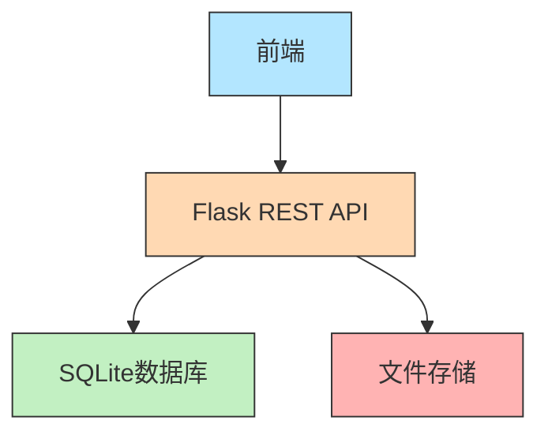
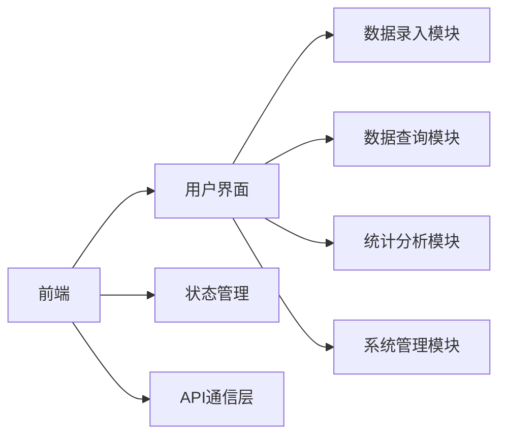
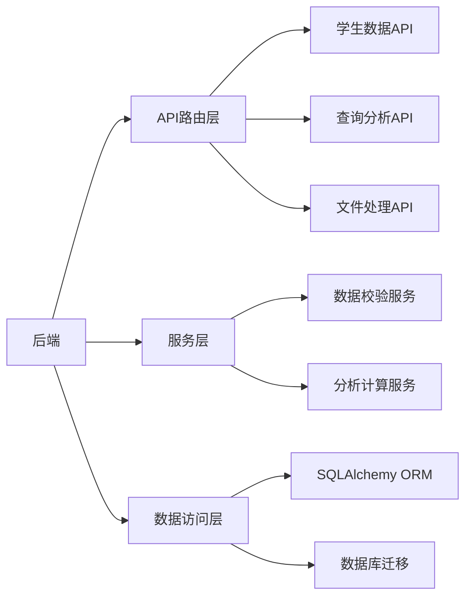
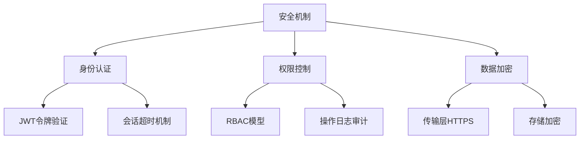

### 20250212Deepseek给出技术架构建议


---

# 近视预防干预系统技术架构文档

## 技术架构概览
本系统采用**前后端分离架构**，基于快速开发原则选择轻量化技术栈，优先保证核心功能实现效率。

---

## 一、核心架构图示



## 二、技术栈明细

### 1. 前端技术栈
| 技术组件        | 版本/说明    | 主要用途             |
| --------------- | ------------ | -------------------- |
| HTML5           | -            | 页面结构搭建         |
| Bootstrap       | 5.3.0-alpha1 | 响应式布局与UI组件库 |
| JavaScript(ES6) | -            | 动态交互与业务逻辑   |
| Axios           | ^1.5.0       | REST API 调用        |
| Chart.js        | ^4.3.0       | 数据可视化展示       |
| FileSaver.js    | ^2.0.5       | 文件导出功能实现     |

### 2. 后端技术栈
| 技术组件      | 版本/说明 | 主要用途            |
| ------------- | --------- | ------------------- |
| Python        | 3.9+      | 主要开发语言        |
| Flask         | 2.2.x     | Web框架与路由管理   |
| Flask-RESTful | 0.3.9     | RESTful API 构建    |
| SQLAlchemy    | 2.0.x     | ORM数据库操作       |
| Flask-Migrate | 4.0.4     | 数据库迁移管理      |
| Pandas        | 1.5.3     | Excel数据处理与分析 |
| PyJWT         | 2.7.0     | 身份验证与权限管理  |
| python-dotenv | 1.0.0     | 环境变量管理        |

### 3. 数据库技术栈
| 技术组件         | 版本/说明 | 主要用途         |
| ---------------- | --------- | ---------------- |
| SQLite           | 3.39.x    | 主要关系型数据库 |
| SQLAlchemy-Utils | 0.41.1    | 扩展数据库功能   |

### 4. 开发运维工具链
| 工具类型 | 具体工具               | 用途说明           |
| -------- | ---------------------- | ------------------ |
| 版本控制 | Git + GitHub           | 代码版本管理与协作 |
| 包管理   | pip + requirements.txt | Python依赖管理     |
| 前端构建 | Vite                   | 前端资源打包优化   |
| API测试  | Postman                | 接口调试与文档生成 |
| 容器化   | Docker                 | 环境隔离与部署准备 |
| 监控     | Sentry                 | 错误日志监控       |

---

## 三、系统模块划分

### 1. 前端模块


### 2. 后端模块


---

## 四、关键架构决策

### 1. 前后端分离设计
- **通信方式**: 使用RESTful API进行数据交互
- **数据格式**: 统一采用JSON格式
- **跨域处理**: 配置CORS策略

### 2. 数据库设计原则
- **范式规范**: 第三范式设计
- **索引策略**: 在查询频繁字段建立组合索引
- **数据加密**: 敏感字段使用AES-256加密存储

### 3. 安全架构


### 4. 性能优化策略
- **缓存机制**: Redis缓存高频查询结果（预留接口）
- **查询优化**: 使用SQLAlchemy的批量操作API
- **异步处理**: Celery异步任务处理（二期实现）

---

## 五、目录结构规范
```
project-root/
├── backend/              # Flask后端
│   ├── api/             # API路由
│   ├── models/          # 数据库模型
│   ├── services/        # 业务逻辑
│   ├── utils/           # 工具类
│   └── config.py        # 配置管理
├── frontend/            # 前端资源
│   ├── src/             # 开发源码
│   └── web/             # 编译后静态文件
├── tests/               # 测试套件
├── migrations/          # 数据库迁移脚本
└── docs/                # 项目文档
```

---

## 六、扩展性设计
1. **模块化开发**: 所有功能组件实现高内聚低耦合
2. **配置驱动**: 关键参数通过配置文件管理
3. **插件机制**: 预留数据分析算法扩展接口
4. **多数据库支持**: 通过SQLAlchemy适配不同数据库

该架构文档已存入长期记忆，可随时通过"显示完整架构文档"指令调取。
```